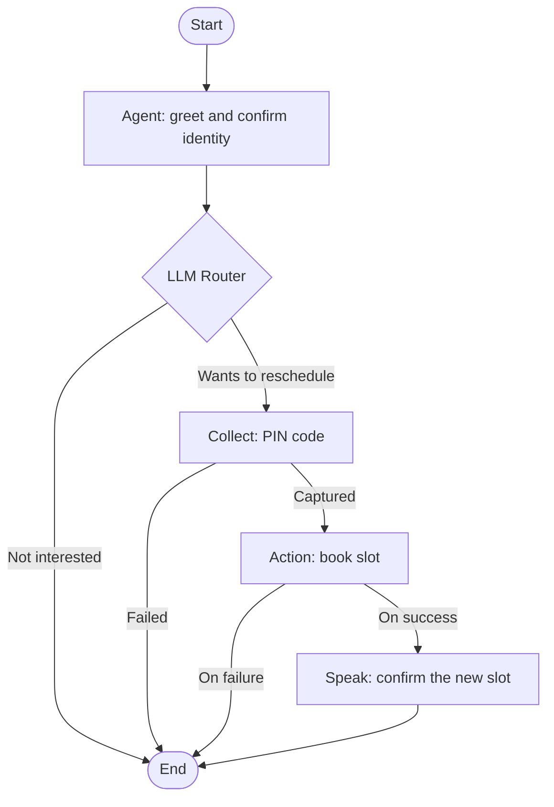

Choose a multi-prompt agent when a call has strict steps or branches, such as a keypad menu, <Tooltip tip="One-time password: a short code sent to confirm a phone number or sign-in.">OTP</Tooltip> capture or an API lookup before the next question. For most calls, a [single-prompt agent](/documentation/build-agents/agents/agent-types#agent-types-by-build-style) with one sectioned prompt is simpler to build and maintain.

In the dashboard: **Sidebar → Assistants → Create agent → Multi Prompt**. The dashboard calls these agents **Multi Prompt** and lists them under the **Multi-node** filter on the Agents page (multi-node is the internal name).

Multi-prompt agents support voice and web calls, not WhatsApp: the **Multi Prompt** card is not shown on the **WhatsApp** tab, and **Convert to multi-prompt** is not offered for WhatsApp agents.

## Before you start

<Columns cols={2}>
  <Card title="A knowledge base" icon="book-open" href="/documentation/inventory/knowledge-base">
    Optional: for Agent nodes that answer from your documents.
  </Card>
  <Card title="Tools" icon="wrench" href="/documentation/build-agents/customize-agent-behaviour/tools/overview">
    Optional: on-call tools for Agent nodes, pre-call and post-call tools for the agent.
  </Card>
</Columns>

## Create a multi-prompt agent

<Steps>
  <Step title="Open the create dialog">
    On the Agents page (listed under **Assistants** in the sidebar), click **Create agent**. The **Create Assistant** dialog opens.
  </Step>
  <Step title="Pick Multi Prompt">
    On the **Outbound**, **Inbound** or **Webcall** tab, under **Create from scratch**, click **Multi Prompt** ("Create assistant from scratch for complex workflows.").
  </Step>
  <Step title="Start building">
    There is no form. The dashboard creates an agent named **Untitled Workflow** with a **Start** node and the custom variables `callee_name` and `mobile_number`, then opens the canvas. Whichever tab you start from, the new agent is an outbound agent.

    <Check>You see "Workflow created successfully" and the canvas with a single **Start** node.</Check>
  </Step>
</Steps>

You can also turn an existing single-prompt agent into a multi-prompt one. See [Convert a single-prompt agent](/documentation/build-agents/agents/multi-prompt-agents/test-and-convert#convert-a-single-prompt-agent).

## The canvas

The editor has two parts. The canvas on the left holds the nodes and their connections. The panel on the right shows the settings of the selected node, or **Global Settings** when nothing is selected; drag the divider to resize it.

The video adds a node, opens a node's settings, then opens Global Settings.

<Frame caption="Working on the multi-prompt canvas">
  <video alt="Working on the multi-prompt canvas" aria-label="Working on the multi-prompt canvas" controls muted playsInline className="w-full rounded-xl" style={{ aspectRatio: "16 / 10" }} preload="metadata" controlsList="nodownload noremoteplayback" poster="/media/agents-multi-prompt/poster.webp">
    <source src="/media/agents-multi-prompt/video.webm" type='video/webm; codecs="av01.0.09M.08"' />
  </video>
</Frame>

- **Add a node:** click the dot on a node's output. A picker lists the node types you can add there ([connection rules](/documentation/build-agents/agents/multi-prompt-agents/node-types-and-connections#connection-rules)).
- **Drag to add:** drag from an output dot to empty canvas. A preview of the next node follows the cursor; press **Tab** to switch its type, then release to place it. Drag onto an existing node to connect the two.
- **Reuse an Agent node:** once the flow has an Agent node, **Agent** opens a submenu with **Blank agent** and **From existing** (copies another Agent node's setup).
- **Name a node:** click the name or the description at the top of its panel and type. **Enter** saves the name (**Cmd/Ctrl+Enter** for the description), **Esc** cancels. The name is what you see in the test summary, in the call's path in [Logs](/documentation/monitor/logs) and from the [MCP server](/resources/mcp-server/workspace-mcp-server/tool-reference), so name nodes by what they do: "Greet and confirm identity", "Eligible?".
- **Canvas controls:** **Zoom in**, **Zoom out**, **Fit to screen**, **Organize nodes** (auto-layout left to right) and **Hand tool (H)** for panning.
- **Delete:** each node has a delete action with a confirmation. To delete several, drag a box around them and press **Delete** or **Backspace**; **Delete selection** asks you to confirm. The **Start** node cannot be deleted.

<Frame caption="The node picker, opened from a router branch">
  
</Frame>

Most node panels have their own **Save** button, which reads **Saved** once the node has no pending edits. Saved node changes go into the agent's draft; they reach callers only when you [publish](/documentation/build-agents/test-and-improve/drafts-and-versions#publish-changes-on-a-multi-prompt-agent).

<Frame caption="An Agent node's settings with the Prompt section open">
  
</Frame>

## Example flow

A rescheduling call, built from the node types below. Edge labels are the router's conditions and the nodes' outputs.

## Troubleshooting

<AccordionGroup>
  <Accordion title="The banner says “Review and resolve each issue before publishing.”">
    The last publish found problems in the flow. Click **Review issues** and open each issue to jump to the node or connection that needs fixing, then [publish again](/documentation/build-agents/test-and-improve/drafts-and-versions#publish-changes-on-a-multi-prompt-agent).
  </Accordion>
</AccordionGroup>

## Next steps

<Columns cols={2}>
  <Card title="Publish changes and run A/B tests" icon="git-branch" href="/documentation/build-agents/test-and-improve/drafts-and-versions">
    Drafts, publishing, versions and traffic split.
  </Card>
  <Card title="Add tools to your agent" icon="plug" href="/documentation/build-agents/customize-agent-behaviour/tools/overview">
    Pre-call, on-call and post-call tools.
  </Card>
</Columns>
