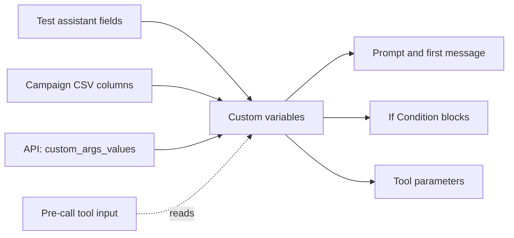

A custom variable is a named value that changes from one call to the next, such as the caller's name, an amount due or an appointment date. You write the variable once in the agent's [prompt](/documentation/build-agents/customize-agent-behaviour/agent-prompt), and each call fills in its own value.

In the dashboard: **Sidebar → Assistants →** open an agent **→ Custom Variables**. On a [multi-prompt agent](/documentation/build-agents/agents/multi-prompt-agents/overview), open **Global Settings → Custom variables**.

Where values come from, and where they go:



## Before you start

<Columns cols={2}>
  <Card title="An agent" icon="bot" href="/documentation/build-agents/agents/create-an-agent" horizontal>
    Variables belong to it and to each of its [versions](/documentation/build-agents/test-and-improve/drafts-and-versions).
  </Card>
  <Card title="An API key" icon="key" href="/documentation/manage-account/api-key" horizontal>
    Optional: only to fill or edit variables by API.
  </Card>
</Columns>

## The two permanent variables

Two variables are permanent: `callee_name` and `mobile_number`. The **Custom Variables** panel shows no remove button for them, and a new multi-prompt agent starts with both.

<ResponseField name="callee_name" type="string">
  The name of the person on the call. On an API call it defaults to the request's `name`. Inbound calls and web calls don't fill it unless you send it.
</ResponseField>
<ResponseField name="mobile_number" type="string">
  Their phone number. On an API call it defaults to the request's `mobile_number`; on an inbound call it is the caller's number. Web calls don't fill it.
</ResponseField>

## Add a variable

<Frame caption="Adding a variable and using it in the prompt">
  <video alt="Adding a variable and using it in the prompt" aria-label="Adding a variable and using it in the prompt" controls muted playsInline className="w-full rounded-xl" style={{ aspectRatio: "16 / 10" }} preload="metadata" controlsList="nodownload noremoteplayback" poster="/media/agents-variables/poster.webp">
    <source src="/media/agents-variables/video.webm" type='video/webm; codecs="av01.0.09M.08"' />
  </video>
</Frame>

<Steps>
  <Step title="Type a name">
    In the editor sidebar, click **Custom Variables**. The panel lists the agent's variables in the order they were added. Type into **Enter variable name**: as you type, letters become lowercase and spaces become `_`, so "Due Date" becomes `due_date`.
  </Step>
  <Step title="Add it">
    Click **Add** or press Enter. There is no separate Save; the list is saved at once. "Variable already exists" means the name is taken; because input is lowercased, `Due_Date` and `due_date` are the same name.

    <Check>You see "Variables updated successfully". The new variable is at the bottom of the list, and it appears under **Custom Variables** when you type `@` in the [prompt](/documentation/build-agents/customize-agent-behaviour/agent-prompt).</Check>

    <Frame caption="The Custom Variables panel after adding loan_account">
      
    </Frame>
  </Step>
</Steps>

Remove a variable with the bin icon on its row. Sort the list alphabetically with the sort icon (tooltip **Sort alphabetically**); click again to return to the order they were added (tooltip **Newest first**).

### Naming rules

Use short, descriptive snake_case names such as `emi_amount` or `due_date`. A campaign CSV maps columns by exact name, so the same names in your CSV save mapping work ([calling list](/documentation/deploy/campaigns/calling-list)).

You can also create a variable while writing the prompt: type `@{{` and a new name, then choose **Create "…"** from the menu ([Write the prompt](/documentation/build-agents/customize-agent-behaviour/agent-prompt#create-a-variable-from-the-menu)). That path keeps the name exactly as typed, so type it in lowercase yourself.

## Use variables in the prompt

Type `@` in the first message or any prompt section and pick the variable under **Custom Variables**. It appears as a chip; its text form is `@{{name}}`.

```text
First message:
Hello @{{callee_name}}, this is Asha from Acme Finance. Is this a good time to talk?

Conversation Script:
1. Confirm you are speaking to @{{callee_name}}.
2. Tell them their EMI of @{{emi_amount}} is due on @{{due_date}}.
3. Ask when they will pay.
```

<Frame caption="Picking the new variable from the @ menu">
  
</Frame>

A token that names a variable the agent does not have is shown in red with a wavy underline: add the variable or fix the spelling. Variables also work in [tool parameters](/documentation/build-agents/customize-agent-behaviour/tools/api-tools#parameter-sources) and in [If Condition blocks](/documentation/build-agents/customize-agent-behaviour/agent-prompt#if-condition-blocks).

## Fill variables for each call

The same variables are filled in different ways, depending on how the call starts. Values are sent as strings. Write them the way the agent should say them (`15 October`, not `2025-10-15`), or tell the agent in the prompt how to read them.

### From a test call

**Test assistant** shows one optional field per variable (for example **Due date**), except `mobile_number`, which comes from **Callee number** on a phone call. See [Test an agent](/documentation/build-agents/test-and-improve/test-an-agent#test-options).

### From a campaign CSV

Each variable is mapped to a CSV column under **Map variables to CSV columns** ([map variables to columns](/documentation/deploy/campaigns/calling-list#map-variables-to-columns)), and every variable must be mapped before you can continue. Each row then fills the variables for one call:

```text
callee_name,mobile_number,emi_amount,due_date
Priya Sharma,9876543210,"₹4,500",15 October
```

The [calling list reference](/documentation/deploy/campaigns/calling-list) covers the CSV format and auto-mapping.

### From the API

[Initiate Individual Call](/api-reference/endpoint/calling/initiate-individual-call) takes the variables in `custom_args_values`, an object of `name: value` pairs. `name` and `mobile_number` are required request fields. When you send `custom_args_values`, it must include every variable the agent has, or the call fails with `400` "Missing custom arguments: …". When you leave it out, only `callee_name` and `mobile_number` are filled. Send your [API key](/documentation/manage-account/api-key) in `X-API-KEY`; `from_number` is the [caller ID](/documentation/inventory/phone-numbers/inbound-agent-number#outbound-choose-the-caller-id).

<CodeGroup>
```bash cURL
curl -X POST "https://prod-api.ringg.ai/ca/api/v0/calling/outbound/individual" \
  -H "X-API-KEY: $RINGG_API_KEY" \
  -H "Content-Type: application/json" \
  -d '{
    "name": "Priya Sharma",
    "mobile_number": "+919876543210",
    "agent_id": "00000000-0000-4000-8000-0000000000a1",
    "from_number": "+919876540110",
    "custom_args_values": {
      "callee_name": "Priya",
      "emi_amount": "₹4,500",
      "due_date": "15 October"
    }
  }'
```

```javascript JavaScript
const response = await fetch("https://prod-api.ringg.ai/ca/api/v0/calling/outbound/individual", {
  method: "POST",
  headers: {
    "X-API-KEY": process.env.RINGG_API_KEY,
    "Content-Type": "application/json",
  },
  body: JSON.stringify({
    name: "Priya Sharma",
    mobile_number: "+919876543210",
    agent_id: "00000000-0000-4000-8000-0000000000a1",
    from_number: "+919876540110",
    custom_args_values: {
      callee_name: "Priya",
      emi_amount: "₹4,500",
      due_date: "15 October",
    },
  }),
});
console.log(await response.json());
```

```python Python
import os
import requests

response = requests.post(
    "https://prod-api.ringg.ai/ca/api/v0/calling/outbound/individual",
    headers={"X-API-KEY": os.environ["RINGG_API_KEY"]},
    json={
        "name": "Priya Sharma",
        "mobile_number": "+919876543210",
        "agent_id": "00000000-0000-4000-8000-0000000000a1",
        "from_number": "+919876540110",
        "custom_args_values": {
            "callee_name": "Priya",
            "emi_amount": "₹4,500",
            "due_date": "15 October",
        },
    },
)
print(response.json())
```
</CodeGroup>

<Check>The response echoes the values the call received in `data.custom_args_values`.</Check>

The [number pool version](/api-reference/endpoint/calling/initiate-individual-call-v2) takes the same field.

### From pre-call tools

A pre-call tool runs before the call starts. It can take a variable as an input (offered as `custom_args.<name>`, for example to look up a customer by `custom_args.mobile_number`), and its selected response keys go into the prompt as `@((tool_name.key))`. Use this when the value lives in your system rather than in the CSV or API request. See [Tools](/documentation/build-agents/customize-agent-behaviour/tools/overview) and the [look-up example](/documentation/build-agents/customize-agent-behaviour/tools/api-tools#example-look-up-the-customer-before-the-call).

## When a value is missing

The dashboard does not stop a test call with empty variables. A variable sent as an empty string becomes empty text. A variable that isn't sent at all stays in the prompt as written, for example `@{{due_date}}`, and the call goes ahead.

Write the prompt so a missing value does not derail the call: "If the due date is not known, ask the customer to check their statement." Or wrap the sentence in an [If Condition block](/documentation/build-agents/customize-agent-behaviour/agent-prompt#if-condition-blocks) that checks the variable **is not empty**. That check works only when the variable is sent as an empty string: an unsent variable counts as not empty.

## Variables by API

[Edit Assistant](/api-reference/endpoint/assistant/edit-assistant) with `"operation": "edit_custom_vars"` sets the agent's variable names in `custom_variables`, the same list the **Custom Variables** panel shows. [Create Agent](/api-reference/endpoint/assistant/create-agent) takes `custom_variables` too.

The list you send replaces the agent's list, so include every variable you want to keep, `callee_name` and `mobile_number` too: an outbound agent rejects a list without them with `403`. The API keeps names exactly as sent, so send them in lowercase snake_case.

```bash cURL
curl -X PATCH "https://prod-api.ringg.ai/ca/api/v0/agent/v1" \
  -H "X-API-KEY: $RINGG_API_KEY" \
  -H "Content-Type: application/json" \
  -d '{
    "operation": "edit_custom_vars",
    "agent_id": "00000000-0000-4000-8000-0000000000a1",
    "custom_variables": ["callee_name", "mobile_number", "emi_amount", "due_date"]
  }'
```

## Troubleshooting

<AccordionGroup>
  <Accordion title="The agent says the variable name, or nothing, instead of the value">
    The call did not receive that variable. Check the call's **Custom variables** in [Logs](/documentation/monitor/logs#the-call-panel), and make sure the key in `custom_args_values` or the CSV column matches the variable name exactly.
  </Accordion>
</AccordionGroup>

## Next steps

<Columns cols={3}>
  <Card title="Fetch data with tools" icon="wrench" href="/documentation/build-agents/customize-agent-behaviour/tools/overview">
    Look up values before the call starts.
  </Card>
  <Card title="Add a knowledge base" icon="book-open" href="/documentation/inventory/knowledge-base">
    Let the agent answer from your files and web pages.
  </Card>
  <Card title="Prepare a calling list" icon="list-checks" href="/documentation/deploy/campaigns/calling-list">
    Fill variables for every contact from a CSV.
  </Card>
</Columns>
