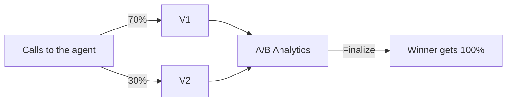

A version is a complete copy of an agent's configuration (prompt or flow, voice, tools and settings) that you can edit and send calls to on its own. Every agent starts with one version, `v1`. Add more versions when you want to A/B test a change on real traffic before you commit to it; for a one-off fix, edit the agent and save or publish instead.

In the dashboard: **Sidebar → Assistants →** open an agent. Single-prompt agents use **Create Versions** in the editor sidebar; [multi-prompt agents](/documentation/build-agents/agents/multi-prompt-agents/overview) use the version tabs above the canvas.

## Before you start

<Columns cols={2}>
  <Card title="An agent" icon="bot" href="/documentation/build-agents/agents/create-an-agent" horizontal>
    Ideally already [tested](/documentation/build-agents/test-and-improve/test-an-agent) with the change you want to split traffic on.
  </Card>
  <Card title="An API key" icon="key" href="/documentation/manage-account/api-key" horizontal>
    Optional: only to call a specific version from your backend.
  </Card>
</Columns>

## How changes go live

Single-prompt and multi-prompt agents save changes differently.

| | Single-prompt agent | Multi-prompt agent |
|---|---|---|
| Prompt or flow edits | Held as unsaved edits until you click **Save** (or press Cmd/Ctrl+S) | Written to a draft as you edit |
| Other settings | Most save as soon as you change them | Saved to the draft |
| Top bar while changes are pending | **Discard** and **Save** | **Discard** and **Publish** |
| What makes changes live | **Save** | **Publish**, then confirm |
| Testing | Save first; **Test assistant** returns after saving | Publish or discard first; **Test assistant** returns after |

### Save changes on a single-prompt agent

**Save** (or Cmd/Ctrl+S) stores the prompt on the version you are viewing; **Discard** throws the unsaved edits away. The editor's save behaviour is in [Save or discard](/documentation/build-agents/customize-agent-behaviour/agent-prompt#save-or-discard).

### Publish changes on a multi-prompt agent

Edits on the canvas, in node panels and in **Global Settings** go into a draft, and a banner above the canvas reads **This workflow has unpublished changes** (or **This workflow has not yet been published** for a new agent). Callers keep getting the last published flow until you publish.

<Steps>
  <Step title="Publish">
    Click **Publish** in the top bar. The **Publish Changes** dialog asks: "Are you sure you want to publish these changes? This will make them live." Click **Publish**.
  </Step>
  <Step title="Fix issues if the publish is rejected">
    Ringg checks the flow on every publish. If it finds problems, the banner turns red with "Review and resolve each issue before publishing." Click **Review issues**, open each issue to jump to the node or connection, fix it and publish again ([connection rules](/documentation/build-agents/agents/multi-prompt-agents/node-types-and-connections#connection-rules)).

    <Check>The draft banner disappears and **Test assistant** returns to the top bar. [Test the agent](/documentation/build-agents/test-and-improve/test-an-agent) to hear the published flow.</Check>
  </Step>
</Steps>

**Discard** reverts the draft to the last published version. Its dialog warns: "Are you sure you want to discard all changes? This action cannot be undone." Discard stays available even when the draft has issues.

If a draft already exists when you open the agent (for example, from an earlier session or the [MCP server](/resources/mcp-server/workspace-mcp-server/overview)), the editor opens in draft mode and shows **Draft Mode Enabled**.

## A/B test a single-prompt agent

An <Tooltip tip="Sending part of real call traffic to each of two or more versions and comparing results.">A/B test</Tooltip> splits calls between versions of the same agent:



The video turns on Create Versions, adds V2, adds a note to it, and splits traffic 70/30.

<Frame caption="Adding a version and splitting traffic in the dashboard">
  <video alt="Adding a version and splitting traffic in the dashboard" aria-label="Adding a version and splitting traffic in the dashboard" controls muted playsInline className="w-full rounded-xl" style={{ aspectRatio: "16 / 10" }} preload="metadata" controlsList="nodownload noremoteplayback" poster="/media/agents-versions/poster.webp">
    <source src="/media/agents-versions/video.webm" type='video/webm; codecs="av01.0.09M.08"' />
  </video>
</Frame>

<Steps>
  <Step title="Turn on versions">
    In the editor sidebar under **Advanced Settings**, switch on **Create Versions** ("A/B Testing Enabled — You can now create multiple versions"). A version bar appears above the editor, showing **V1**.
  </Step>
  <Step title="Add a version">
    Click **+** in the version bar. With one version, the new one copies it. With two or more, pick the **Base** version to copy from. An agent can have up to 5 versions.

    <Frame caption="The version bar after adding V2">
      
    </Frame>
  </Step>
  <Step title="Edit the new version">
    Click a version to switch to it, then change its prompt or settings. Each version keeps its own configuration ([prompt](/documentation/build-agents/customize-agent-behaviour/agent-prompt), [voice](/documentation/build-agents/customize-agent-behaviour/voice-and-language), [variables](/documentation/build-agents/customize-agent-behaviour/custom-variables), [knowledge base](/documentation/build-agents/customize-agent-behaviour/attach-a-knowledge-base)). Open a version's menu to **Add notes**, **Copy version ID** ([use it in the API](#call-a-specific-version-with-the-api)), or **Delete version** (offered when more than one version exists).
  </Step>
  <Step title="Assign traffic">
    Click the gear in the version bar and choose **Assign Traffic** ("Split calls among different assistant versions"). Set each version's share with its slider and click **Save**; it stays greyed out until the running total reads 100%.

    <Frame caption="Assign Traffic with a 70/30 split">
      
    </Frame>
  </Step>
  <Step title="Compare results">
    From the same gear menu, choose **View Analytics**. **A/B Analytics** compares the versions over the last 7 days.
  </Step>
  <Step title="Finalize the winner">
    Once two or more versions exist, the sidebar row reads **A/B Tests Live!** with a **Finalize** button. Click it, select the winning version in the analytics table, and click **Confirm & Finalize**. All traffic goes to that version and A/B testing is turned off ("Version [slug] is now live. A/B testing has been disabled.").

    <Check>New calls use the winning version only. Review the calls in [Logs](/documentation/monitor/logs).</Check>
  </Step>
</Steps>

A green dot next to a version means it receives traffic; a red dot means 0%. Deleting a version asks for confirmation and warns: "If you delete, all traffic will shift to other versions uniformly." Its share is split equally among the remaining versions: delete the 50% version of a 50/30/20 split and the others get 55/45.

WhatsApp agents do not offer **Create Versions**; the row appears only while a test is already live, so you can finalize it.

## A/B test a multi-prompt agent

The multi-prompt editor has no switch that starts an A/B test; to start one on a multi-prompt agent, contact Ringg. On a multi-prompt agent where A/B testing is already live, version tabs (`V1`, `V2` …) appear above the canvas:

- **Switch versions:** click a tab. The canvas and Global Settings load that version, and your edits apply to it.
- **Add a version:** click **+** at the end of the tabs. The editor switches to the new version.
- **Delete a version:** open the tab's **…** menu and choose **Delete version** (shown when more than one version exists). It is deleted at once, with no confirmation.
- **Split traffic:** click the gear to open **Manage Traffic Split**, set each version's slider and click **Save Changes**.

The multi-prompt editor has no **Finalize** action. To send all calls to one version, delete the others.

## Traffic split rules

| Rule | Single-prompt (**Assign Traffic**) | Multi-prompt (**Manage Traffic Split**) |
|---|---|---|
| Total | Must equal exactly 100% to save | Must equal exactly 100% to save |
| Step | 5% | 5% |
| Minimum per version | 0% | 5% |
| Maximum versions | 5 | 5 |

Calls are shared between versions in proportion to their traffic. Each API, inbound or workflow call picks a version at random, weighted by the split. A campaign divides its contact list by count, in list order: with 70/30, roughly the first 70% of the list goes to one version, so shuffle the list if its order matters. A retry keeps its call's version, and a callback uses the version of the call it follows up. Each call records the version it used: see `version_slug` in [webhook payloads](/documentation/build-agents/customize-agent-behaviour/webhooks/call-events) (sent by [Event Subscription](/documentation/build-agents/customize-agent-behaviour/event-subscription)) and `agent.version` in [call history](/api-reference/endpoint/history/get-call-history).

## Call a specific version with the API

[Initiate Individual Call](/api-reference/endpoint/calling/initiate-individual-call) accepts an optional `version_id`. With it, the call uses that version and skips the traffic split. Without it, the call uses the agent's active version, or follows the traffic split while an A/B test runs. Campaigns can't pin a version. Copy a single-prompt version's ID from its menu in the version bar.

Send your [API key](/documentation/manage-account/api-key) in `X-API-KEY`. `from_number` is the [caller ID](/documentation/inventory/phone-numbers/inbound-agent-number#outbound-choose-the-caller-id).

<CodeGroup>
```bash cURL
curl -X POST https://prod-api.ringg.ai/ca/api/v0/calling/outbound/individual \
  -H "X-API-KEY: $RINGG_API_KEY" \
  -H "Content-Type: application/json" \
  -d '{
    "name": "Priya Sharma",
    "mobile_number": "+919876543210",
    "agent_id": "b1972188-038e-4605-916c-3926e9d7bde4",
    "from_number": "+919876500000",
    "version_id": "e301689c-3701-4665-9b1a-06cc12a88974"
  }'
```

```javascript JavaScript
const response = await fetch("https://prod-api.ringg.ai/ca/api/v0/calling/outbound/individual", {
  method: "POST",
  headers: {
    "X-API-KEY": process.env.RINGG_API_KEY,
    "Content-Type": "application/json",
  },
  body: JSON.stringify({
    name: "Priya Sharma",
    mobile_number: "+919876543210",
    agent_id: "b1972188-038e-4605-916c-3926e9d7bde4",
    from_number: "+919876500000",
    version_id: "e301689c-3701-4665-9b1a-06cc12a88974",
  }),
});
console.log(await response.json());
```

```python Python
import os
import requests

response = requests.post(
    "https://prod-api.ringg.ai/ca/api/v0/calling/outbound/individual",
    headers={"X-API-KEY": os.environ["RINGG_API_KEY"]},
    json={
        "name": "Priya Sharma",
        "mobile_number": "+919876543210",
        "agent_id": "b1972188-038e-4605-916c-3926e9d7bde4",
        "from_number": "+919876500000",
        "version_id": "e301689c-3701-4665-9b1a-06cc12a88974",
    },
)
print(response.json())
```
</CodeGroup>

[Initiate Individual Call v2](/api-reference/endpoint/calling/initiate-individual-call-v2) takes the same optional `version_id` and calls from a [number pool](/documentation/inventory/phone-numbers/number-pools). Pinning a version lets you test a new version from your backend before you give it traffic.

## Next steps

<Columns cols={3}>
  <Card title="Before a voice agent goes live" icon="phone" href="/documentation/build-agents/customize-agent-behaviour/voice-and-language#before-a-voice-agent-goes-live">
    The checklist before a phone agent goes live.
  </Card>
  <Card title="Run a campaign" icon="megaphone" href="/documentation/deploy/campaigns/create-a-campaign">
    Send real traffic through the split.
  </Card>
  <Card title="Compare versions in Analytics" icon="chart-line" href="/documentation/monitor/analytics">
    Tick the agent, then untick all but the ones you want in the charts.
  </Card>
</Columns>
