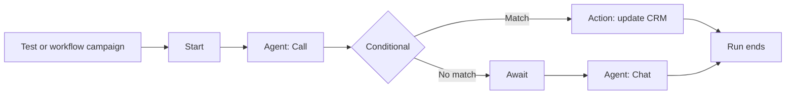

import { RelatedTopics } from "/snippets/related-topics.mdx";

A workflow is a graph of steps that Ringg runs once for each contact: call them with one [agent](/documentation/build-agents/agents/agent-types), branch on how the call went, wait a day, update your CRM, then follow up with another agent or a message. Use one when the journey spans several conversations; a single agent, even a [multi-prompt](/documentation/build-agents/agents/multi-prompt-agents/overview) one, holds one conversation. This chapter has two pages: this overview and [Build, test and run a workflow](/documentation/build-agents/workflows/build-a-workflow), which holds the procedure and the block reference.

In the dashboard: **Sidebar → Workflows**.

<Frame caption="The Workflows list, one workflow's canvas, and a run in Logs">
  <video alt="The Workflows list, one workflow's canvas, and a run in Logs" aria-label="The Workflows list, one workflow's canvas, and a run in Logs" controls muted playsInline className="w-full rounded-xl" style={{ aspectRatio: "16 / 10" }} preload="metadata" controlsList="nodownload noremoteplayback" poster="/media/workflows-overview/poster.webp">
    <source src="/media/workflows-overview/video.webm" type='video/webm; codecs="av01.0.09M.08"' />
  </video>
</Frame>

## Workflow, agent or campaign?

| You want to… | Use |
| --- | --- |
| Hold one conversation (phone, web or WhatsApp) | An [agent](/documentation/build-agents/agents/create-an-agent) |
| Move one call through stages (greet, qualify, transfer) | A [multi-prompt agent](/documentation/build-agents/agents/multi-prompt-agents/overview): one conversation, several prompts on a canvas |
| Call a [CSV list](/documentation/deploy/campaigns/calling-list) with one agent, with retries and calling hours | A [campaign](/documentation/deploy/campaigns/create-a-campaign) of type **Assistant** |
| Call, then follow up on the result (call again, message, wait a day) | A workflow |
| Update your CRM or call your API between conversations | A workflow with an **Action** block |
| Run that multi-step journey for every row of a CSV | A workflow launched as a [campaign](/documentation/deploy/campaigns/workflow-campaign#workflow-campaigns) of type **Workflow** |

The trade-off: a workflow gives you logic between conversations, but you build and test each agent separately, and every run can place several calls.

## How a workflow runs

- You build on a canvas, from a **Start** marker, connecting blocks left to right.
- Each contact gets their own **run**: one pass through the graph, carrying that contact's name, number and [variables](/documentation/build-agents/workflows/build-a-workflow#variables-and-data-between-steps).
- A Conditional block sends the run down **Match** or **No match**. An Await block in Event mode adds a **Timeout** branch.
- A run ends at a block with nothing connected after it. There is no "end" block. A run still going after 3 days is cancelled.
- [**Logs → Workflows**](/documentation/monitor/logs#workflow-runs) records every run, with the path it took and the calls it placed.

## Building blocks

The **Blocks** panel offers four blocks. The Agent block has a **Call** and a **Chat** mode.

| Block | What it does | Branches out |
| --- | --- | --- |
| **Agent** (Call) | Calls the contact with one of your [agents](/documentation/build-agents/agents/create-an-agent), from your [numbers](/documentation/inventory/phone-numbers/buy-or-import-a-number), inside a <Tooltip tip="The hours of the day in which calls may be placed.">call window</Tooltip>, with retries. | One |
| **Agent** (Chat) | Sends a WhatsApp, SMS or email message, optionally handing the conversation to a chat agent. | One |
| **Conditional** | Checks rules against earlier steps: call status, duration, [Advanced Analysis](/documentation/build-agents/customize-agent-behaviour/advanced-analysis) fields, API responses, variables. | **Match** / **No match** |
| **Await** | Pauses the run for a duration, until a time, or until a named event arrives. | One, plus **Timeout** in Event mode |
| **Action** | Calls any HTTP API (GET, POST, PUT, PATCH, DELETE); later steps can read its JSON response. | One |

Every setting is in the [block reference](/documentation/build-agents/workflows/block-reference#block-reference).

## How a workflow starts

| Trigger | Where | Available |
| --- | --- | --- |
| **Test** | Workflow editor, top bar ([Test a run](/documentation/build-agents/workflows/test-and-publish#test-a-run)) | Yes. One run with values you type. |
| **File upload** | [**Campaigns → Create campaign**](/documentation/deploy/campaigns/workflow-campaign#workflow-campaigns), type **Workflow** | Yes. One run per CSV row, now or at a scheduled time. |
| **Webhook URL** | Same campaign screen | No, marked **Coming soon** |
| **Event trigger** | Same campaign screen | No, marked **Coming soon** |

## Statuses and versions

| Status | Meaning |
| --- | --- |
| **Draft** | Saved but never published. You can edit and test it. |
| **Active** | Published. It can be picked for a workflow campaign. |
| **Archived** | Read-only and can't start new runs. Archiving can't be undone. |

The list groups workflows into **Active**, **Drafts** and a collapsed **Archived** section. A card can also carry **Scheduled**, **Triggering** or **Paused**; those workflows sit under **Active**, and nothing in the editor sets these three states.

<Frame caption="The Workflows list, grouped into Active and Drafts">
  
</Frame>

Each publish creates a version (`v1`, `v2`, shown in the breadcrumb); see [Publish and versions](/documentation/build-agents/workflows/test-and-publish#publish-and-versions).

## Next steps

<Columns cols={2}>
  <Card title="Build and run a workflow" icon="workflow" href="/documentation/build-agents/workflows/build-a-workflow">
    Add blocks, pass data between steps, test a run, publish and launch it at a list.
  </Card>
  <Card title="Launch a workflow campaign" icon="megaphone" href="/documentation/deploy/campaigns/workflow-campaign#workflow-campaigns">
    Each row of a calling list starts one run of the published workflow.
  </Card>
</Columns>

<RelatedTopics items={[["Build a workflow", "/documentation/build-agents/workflows/build-a-workflow"], ["Test and publish a workflow", "/documentation/build-agents/workflows/test-and-publish"], ["Workflow block reference", "/documentation/build-agents/workflows/block-reference"], ["Workflow campaign", "/documentation/deploy/campaigns/workflow-campaign"], ["Workflow runs in Logs", "/documentation/monitor/logs#workflow-runs"]]} />
