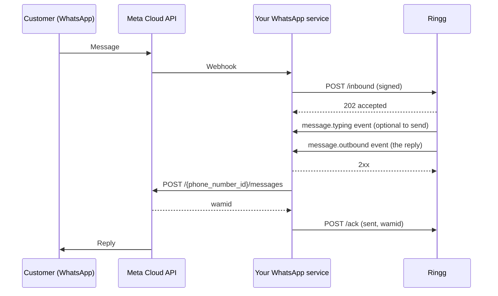

import { RelatedTopics } from "/snippets/related-topics.mdx";

Ringg never holds your WhatsApp access token and never calls Meta for you: your WhatsApp service sits between Meta and Ringg, and the number **stays in your own Meta account**.

Your human agents can work the same chats. When one of them steps away, you hand the conversation to the AI agent with the history so far, and it carries on from there.

<Note>
If Ringg can hold your WhatsApp Business account instead, the [standard WhatsApp setup](/documentation/build-agents/agents/whatsapp-agents/overview) is simpler: connect the account in the dashboard and Ringg talks to Meta directly. Relay is for businesses that need the account, the token and the Meta traffic to stay with them.
</Note>

## Before you start

<Columns cols={2}>
  <Card title="A WhatsApp Business number you operate" icon="message-circle" href="/documentation/deploy/whatsapp/relay-overview#details-to-share-for-setup" horizontal>
    In your own Meta account, with a WhatsApp service of yours that receives its Meta webhooks.
  </Card>
  <Card title="An API key" icon="key" href="/documentation/manage-account/api-key" horizontal>
    Your workspace key is sent as `X-API-Key` on every relay request.
  </Card>
</Columns>

## How it works

1. **Forward:** a customer messages your number. Meta notifies your service, and your service forwards the message to Ringg's `/inbound` endpoint, signed with your keys.
2. **Reply:** Ringg's agent reads the whole conversation and writes a reply. Ringg posts it to your webhook as a `message.outbound` event, in a format you can send to Meta unchanged.
3. **Send and acknowledge:** your service sends the reply to Meta, then reports the result to Ringg's `/ack` endpoint. Ringg uses this to keep its record of the conversation true to what the customer actually saw.

Ringg can also open a conversation with an approved template, and close one with a final message. See [Integration guide](/documentation/deploy/whatsapp/relay-integration-guide).

## Key terms

| Term | Meaning |
|---|---|
| `phone_number_id` | Meta's id for your WhatsApp number. Every relay request carries it, and it is how Ringg finds the agent attached to the number. |
| Chat | One conversation between a customer and your number, identified by `chat_id`. A new chat starts when the previous one has closed. |
| Event | A message from Ringg to your webhook: `message.outbound`, `message.typing` or `conversation.closed`. |
| Ack | Your report of what happened when you sent a `message.outbound` event to Meta: `sent`, `failed` or `skipped`. |
| Handover | Forwarding a message together with the conversation your human agent had so far, so the AI agent continues it. |

## Supported features

### Messages from your customers

| Customer sends | What happens |
|---|---|
| Text | The agent answers. |
| A tap on a template's quick-reply button (`type: "button"`) | Read as the button's label, and answered like text. |
| Image, voice note, video, document, sticker, location, contact card, reaction | Accepted (`202`), then **not answered**. Your human agents should handle these for now. |
| Reply-button or list selection from an interactive message (`type: "interactive"`) | Accepted (`202`), then **not answered**. |
| A message that replies to (quotes) an earlier message | Answered. The agent sees which message it replies to. |

<Note>
`/inbound` always answers `202 accepted` once the message is safely recorded. Whether the agent replies is decided afterwards, so a `202` does not mean a reply is coming. See [No reply for a message](/documentation/deploy/whatsapp/relay-troubleshooting#no-reply-for-a-message).
</Note>

### Messages Ringg asks you to send

| Event | Contains | You |
|---|---|---|
| `message.outbound` | A text reply, or the template that opens a conversation | Send it to Meta as is, then [ack](/documentation/deploy/whatsapp/relay-integration-guide#report-the-result) it |
| `message.typing` | A "mark as read + typing indicator" request for the customer's message | Send it to Meta if you want the customer to see typing; no ack |
| `conversation.closed` | The chat id and the reason | Update your own records; nothing to send |

### Conversation features

| Feature | Supported |
|---|---|
| AI agent replies, using the agent's prompt, knowledge base and tools | Yes |
| [Hand over from a human agent](/documentation/deploy/whatsapp/relay-integration-guide#handover-from-a-human-agent), with up to 200 earlier messages | Yes |
| Hand back to a human agent, then over to the AI again, any number of times | Yes |
| [Custom variables](/documentation/deploy/whatsapp/relay-integration-guide#custom-variables) for the agent, set by the message that starts a chat | Yes |
| [Start a conversation with an approved template](/documentation/deploy/whatsapp/relay-integration-guide#start-a-conversation) | Yes |
| [Close a conversation](/documentation/deploy/whatsapp/relay-integration-guide#close-a-conversation), optionally with a last message | Yes |
| The agent ends a conversation itself (end-chat tool) | Yes, you receive `conversation.closed` |
| Post-chat analysis and [chat events](/documentation/build-agents/customize-agent-behaviour/webhooks/whatsapp-chat-events#whatsapp-chat-events) (`chat_completed`, analysis events) | Yes, same as other WhatsApp agents |
| Chat history in the dashboard, with handover markers | Yes |
| Several numbers, each with its own agent | Yes, register each number |

### Limits

| Limit | Value |
|---|---|
| Clock skew allowed on a signed request | 300 seconds |
| `prior_messages` per request | 200 |
| Length of one prior message | 4,096 characters |
| `handover_note` | 2,000 characters |
| Keys in `custom_args` | 100 |
| Time Ringg waits for your webhook | 10 seconds per attempt |
| Window to ack a reply | 7 days, after which `/ack` answers `unknown_event` |
| `X-Idempotency-Key` on `/outbound` | Remembered for 24 hours |

### Not supported yet

- **Media understanding:** the agent cannot read images, voice notes or documents. This is planned.
- **Rich replies:** the agent's replies are plain text; Ringg never asks you to send media, interactive messages or WhatsApp Flows over the relay.
- **Template sends mid-conversation:** templates are only used to start a conversation.

## What you set up

### Details to share for setup

Share these for **each** WhatsApp number, separately for staging and production.

| Detail | Example | Why Ringg needs it |
|---|---|---|
| `phone_number_id` | `123456789012345` | Meta's id for the number. Every relay request is keyed on it. |
| Display number | `+1 202-555-0100` | Shown in the Ringg dashboard and on the number's logs. |
| WhatsApp Business Account (WABA) id | `234567890123456` | Lets Ringg make sure the account is not also connected to Ringg directly. |
| Webhook URL | `https://wa.example.com/ringg/events` | Where Ringg posts replies and other events. Must be **HTTPS**. |
| Webhook bearer token | a long random string | Ringg sends it as `Authorization: Bearer <token>` on every event, so you can reject anything else. |
| Approved templates (optional) | `renewal_reminder`, `claim_update` | Only needed to [start conversations](/documentation/deploy/whatsapp/relay-integration-guide#start-a-conversation). If you list them, Ringg refuses any other template name up front. |
| How the agent should behave | Use cases, tone, languages, product data, escalation rules | Ringg sets up the AI agent attached to the number. |

<Warning>
Share the bearer token and receive the signing secret over a secure channel, never in a ticket or chat thread. Use different values for staging and production.
</Warning>

### What your WhatsApp service must do

<Steps>
  <Step title="Forward customer messages to /inbound">
    For each message Meta sends to your webhook, `POST` Meta's `value` object to Ringg's [`/inbound`](/documentation/deploy/whatsapp/relay-integration-guide#forward-a-customer-message), unchanged, with `value.messages[0].id` set to Meta's message id. Retry on a timeout or a `5xx`; [each message id is processed once](/documentation/deploy/whatsapp/relay-overview#delivery-guarantees).
  </Step>
  <Step title="Sign every request">
    Send your workspace API key in `X-API-Key`, and an HMAC-SHA256 signature of the exact request body in `X-Relay-Timestamp` and `X-Relay-Signature`. See [Authentication](/documentation/deploy/whatsapp/relay-integration-guide#authentication).
  </Step>
  <Step title="Receive Ringg's events on your webhook">
    Check the bearer token, store or queue the event, and answer `2xx` within 10 seconds. Don't wait for Meta before answering: the chat's next reply waits for your `2xx`.
  </Step>
  <Step title="Send each message.outbound to Meta, then ack it">
    POST `delivery.message` to Meta's `/{phone_number_id}/messages` exactly as received, in `delivery.sequence` order per chat. Then call [`/ack`](/documentation/deploy/whatsapp/relay-integration-guide#report-the-result) with `sent` and Meta's message id, `failed` with Meta's error, or `skipped` if `expires_at` passed before you could send.
  </Step>
  <Step title="Forward Meta's delivery statuses (recommended)">
    `POST` the `statuses` array from Meta's status webhooks to [`/status`](/documentation/deploy/whatsapp/relay-integration-guide#forward-delivery-statuses). Ringg uses them to diagnose delivery problems.
  </Step>
</Steps>

#### Also yours

- **The 24-hour window.** Free-form replies only reach a customer within 24 hours of their last message. Ringg answers inside that window. Outside it, use an approved template through `/outbound`.
- **Media and interactive messages.** The AI agent answers text only. Route images, voice notes, documents and interactive replies to your human agents. See [What's supported](/documentation/deploy/whatsapp/relay-overview#supported-features).
- **Handover.** When a human agent hands a chat to the AI, send the conversation so far in `prior_messages`. When they take it back, stop forwarding that chat's messages to Ringg. See [Hand over from a human agent](/documentation/deploy/whatsapp/relay-integration-guide#handover-from-a-human-agent).
- **Custom variables.** Send the customer details the agent's prompt uses, such as a policy number, in `custom_args` on every `/inbound`. Ringg reads them only when a message starts a chat. See [Custom variables](/documentation/deploy/whatsapp/relay-integration-guide#custom-variables).
- **Clocks.** Keep your servers on NTP. A signature more than 300 seconds old is rejected.

### Before you go live

<Steps>
  <Step title="Test on staging">
    Run your integration against Ringg's staging base URL with your staging number. Cover a plain conversation, a handover with `prior_messages`, a `failed` ack and a `/close`.
  </Step>
  <Step title="Check delivery end to end">
    Confirm that every `message.outbound` you receive gets an ack, and that replies reach the customer in order.
  </Step>
  <Step title="Switch to production">
    Change the base URL, API key and signing secret to the production values Ringg gives you. Nothing else changes.
  </Step>
</Steps>

## What Ringg provides

### Credentials and endpoints

Ringg sends you these once your number is registered, separately for staging and production, along with the staging base URL. The production base URL is in the [Integration guide](/documentation/deploy/whatsapp/relay-integration-guide).

| Item | Value | Notes |
|---|---|---|
| API key | Your Ringg workspace API key | Sent as `X-API-Key`. It identifies your workspace and only works for numbers your workspace owns. |
| Signing secret | One per number | Used to sign every request. It is shown once at registration, so store it securely. |

#### Rotating the signing secret

Ringg can issue a new signing secret at any time while the old one keeps working. Switch your service to the new secret, confirm traffic is flowing, then ask Ringg to retire the old one. Requests signed with either secret are accepted in between, so there is no downtime.

### The AI agent

Ringg sets up and maintains the AI agent attached to your number:

- **Prompt and tone:** written for your use case, in the languages your customers use.
- **Knowledge:** knowledge bases and tools, such as your product data, pricing APIs and document links.
- **Handover:** the agent continues a conversation your human agent started, without greeting again or asking for what the customer already said.
- **Post-chat:** analysis and [chat events](/documentation/build-agents/customize-agent-behaviour/webhooks/whatsapp-chat-events#whatsapp-chat-events) once a conversation closes.

Changes to the agent's behaviour are made on Ringg's side; your integration doesn't change.

### Delivery behaviour

Durable acceptance, once-only processing, ordered and retried replies, and what happens to replies the customer never saw: [Delivery guarantees](/documentation/deploy/whatsapp/relay-overview#delivery-guarantees).

### In the Ringg dashboard

- **Numbers:** your relay numbers carry a **Relay WhatsApp** tag.
- **Logs → WhatsApp:** every relay conversation, with its transcript and analysis. Where a human agent handed over, the transcript marks **Handed over to AI agent** and **Handed over to human agent**. The agent side is labelled **Human agent** or **AI agent**.

### Support

[What to send Ringg support](/documentation/deploy/whatsapp/relay-troubleshooting#what-to-send-ringg-support) is listed with the troubleshooting steps.

## Delivery guarantees

What Ringg promises on every relay number; the request and response details are in the [Integration guide](/documentation/deploy/whatsapp/relay-integration-guide).

| Guarantee | Detail |
|---|---|
| Your inbound message is not lost | `/inbound` answers `202` only after the message is stored. A failed turn is retried by Ringg, up to 3 attempts, not by you. |
| Retries are safe | A message is processed once per `value.messages[0].id`, however many times you send it. |
| Replies arrive in order | One reply per chat is in flight at a time. The next is sent only after your webhook answers `2xx`. Each carries a `sequence` (1, 2, 3, …) per chat. |
| Replies are retried | On a timeout, a network error, or HTTP `408`, `425`, `429`, `500`, `502`, `503` or `504`: up to 8 attempts, backing off from 1 s to 60 s. `Retry-After` is honoured, up to 300 s. |
| Delivery stops on a permanent rejection | Any other `4xx` from your webhook ends delivery of that reply, which is recorded as not delivered. |
| Replies expire | Each reply carries `expires_at`, 60 seconds after it was written. If you cannot send it to Meta before then, don't send it: ack it as `skipped`. |
| Undelivered replies don't confuse the agent | A reply you ack as `failed` or `skipped`, or that your webhook rejected, is kept out of the agent's view of the conversation, so it never refers to something the customer didn't see. |
| Chats Meta won't deliver to are closed | If you ack a reply `failed` with Meta error `131047`, `131026` or `131051`, Ringg closes the chat. |

## FAQ

<AccordionGroup>
  <Accordion title="Does Ringg ever get our WhatsApp access token?">
    No. Ringg only receives the messages you forward and returns replies for you to send ([how it works](/documentation/deploy/whatsapp/relay-overview#how-it-works)).
  </Accordion>

  <Accordion title="How is this different from connecting WhatsApp Business to Ringg?">
    With the [standard setup](/documentation/build-agents/agents/whatsapp-agents/overview) there is nothing to build; with Relay you run a service between Meta and Ringg. Choose Relay when the account must stay in your control, for example because your own CRM and human agents use the same number.
  </Accordion>

  <Accordion title="Can the same WhatsApp Business account be on Relay and connected to Ringg directly?">
    No. An account is either connected to Ringg directly or registered for Relay, never both. Ringg refuses a registration that would mix them.
  </Accordion>

  <Accordion title="Does the AI agent understand images and voice notes?">
    Not yet: media messages are accepted but not answered, so route them to your human agents ([what's supported](/documentation/deploy/whatsapp/relay-overview#not-supported-yet)).
  </Accordion>

  <Accordion title="Why did /inbound return 202 but no reply came?">
    `202` means the message is safely stored, not that a reply will follow. See [No reply for a message](/documentation/deploy/whatsapp/relay-troubleshooting#no-reply-for-a-message).
  </Accordion>

  <Accordion title="Can we retry /inbound?">
    Yes, on timeouts and `5xx`: each message id is [processed once](/documentation/deploy/whatsapp/relay-overview#delivery-guarantees), so a retry never causes a second reply.
  </Accordion>

  <Accordion title="The customer sent three messages in a row. Why one reply?">
    When messages arrive close together, the agent answers them together, as a person would, instead of replying to each.
  </Accordion>

  <Accordion title="What if our webhook is down?">
    Ringg [retries each reply](/documentation/deploy/whatsapp/relay-overview#delivery-guarantees) for about two minutes, and later replies in the same chat wait behind it. If you receive a reply after its `expires_at`, ack it as `skipped` instead of sending it.
  </Accordion>

  <Accordion title="Do we have to send the typing indicator?">
    No. `message.typing` is optional. Sending it shows the customer that the message was read and a reply is coming, which makes the wait feel shorter.
  </Accordion>

  <Accordion title="How does the AI agent know what our human agent already discussed?">
    You send the conversation so far in `prior_messages` when you [hand over](/documentation/deploy/whatsapp/relay-integration-guide#handover-from-a-human-agent).
  </Accordion>

  <Accordion title="Can we change custom_args during a chat?">
    No. Ringg reads `custom_args` only from the message that starts a chat, so later messages can't overwrite them. Send them with every message anyway: when a chat ends, the customer's next message starts a new one, which reads them again. See [Custom variables](/documentation/deploy/whatsapp/relay-integration-guide#custom-variables).
  </Accordion>

  <Accordion title="Can we send the whole history on every handover?">
    Yes, up to 200 messages; Ringg [skips what it already has](/documentation/deploy/whatsapp/relay-integration-guide#hand-a-conversation-to-the-ai-agent) when each message carries Meta's id.
  </Accordion>

  <Accordion title="How do we take a conversation back from the AI agent?">
    Stop forwarding that chat's messages and let your human agent answer ([details](/documentation/deploy/whatsapp/relay-integration-guide#take-a-conversation-back)).
  </Accordion>

  <Accordion title="Does the AI agent say it is an AI?">
    That is set in the agent's prompt, which Ringg agrees with you. By default, Ringg sets the agent up to write as your team, without a personal name, and not to volunteer that it is an AI. If a customer asks directly whether they are talking to a bot, it answers honestly and offers to have a person call them.
  </Accordion>

  <Accordion title="Can the AI agent message a customer first?">
    Only with an approved template, through [`/outbound`](/documentation/deploy/whatsapp/relay-integration-guide#start-a-conversation), which follows WhatsApp's 24-hour rule. You send the template; when the customer replies, the agent takes over.
  </Accordion>

  <Accordion title="How long does a conversation stay open?">
    Until one of the [four closing conditions](/documentation/deploy/whatsapp/relay-troubleshooting#a-chat-closed-unexpectedly) is met; the customer's next message then starts a new chat.
  </Accordion>

  <Accordion title="Do we get transcripts and analysis?">
    Yes, in [**Logs → WhatsApp**](/documentation/deploy/whatsapp/relay-overview#in-the-ringg-dashboard) and through [chat events](/documentation/build-agents/customize-agent-behaviour/webhooks/whatsapp-chat-events#whatsapp-chat-events) on your own endpoint.
  </Accordion>

  <Accordion title="How do we rotate the signing secret?">
    Ask Ringg for a new one; both work until the old one is retired ([rotation](/documentation/deploy/whatsapp/relay-overview#rotating-the-signing-secret)).
  </Accordion>

  <Accordion title="Are staging and production separate?">
    Yes: different base URLs, API keys, signing secrets and number registrations ([before you go live](/documentation/deploy/whatsapp/relay-overview#before-you-go-live)).
  </Accordion>
</AccordionGroup>

## Next steps

<Columns cols={2}>
  <Card title="Integration guide" icon="code" href="/documentation/deploy/whatsapp/relay-integration-guide">
    The endpoints, events, signing and handover.
  </Card>
  <Card title="Troubleshooting" icon="wrench" href="/documentation/deploy/whatsapp/relay-troubleshooting">
    Rejected requests, missing replies and acks.
  </Card>
</Columns>

<RelatedTopics items={[["WhatsApp agents", "/documentation/build-agents/agents/whatsapp-agents/overview"], ["Connect WhatsApp", "/documentation/inventory/tools-integrations/connect-whatsapp"], ["Create a WhatsApp agent", "/documentation/build-agents/agents/whatsapp-agents/create-an-agent"], ["WhatsApp tools", "/documentation/build-agents/customize-agent-behaviour/tools/whatsapp-tools"], ["WhatsApp chat events", "/documentation/build-agents/customize-agent-behaviour/webhooks/whatsapp-chat-events"], ["Start a conversation", "/documentation/deploy/whatsapp/start-a-conversation"], ["WhatsApp Relay integration guide", "/documentation/deploy/whatsapp/relay-integration-guide"], ["WhatsApp Relay troubleshooting", "/documentation/deploy/whatsapp/relay-troubleshooting"], ["WhatsApp chats in Logs", "/documentation/monitor/logs#whatsapp-chats"]]} />
