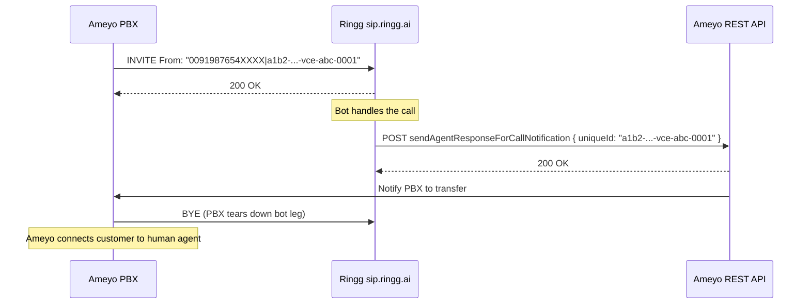

The Ameyo link is one-directional: Ameyo sends every INVITE to Ringg and Ringg never calls back into Ameyo, so the only way a caller returns to a human is the [hand-back](#call-transfer) Ameyo's own API performs.

Ameyo has no entry in the dashboard's **Add number** dialog. Ringg's team sets it up with you; [What Ringg needs to go live](#what-ringg-needs-to-go-live) lists what to send.

## Before you start

<Card title="An agent" icon="bot" href="/documentation/build-agents/agents/create-an-agent" horizontal>
  The Ringg agent that handles the bot leg of every call Ameyo sends over the trunk.
</Card>

## SIP setup

### Endpoint

Point your <Tooltip tip="Session Initiation Protocol: the standard for connecting voice calls between phone systems.">SIP</Tooltip> gateway at:

```text
sip.ringg.ai
Port 5060 (UDP/TCP)
```

### Firewall

Allow the Ringg SIP addresses on your SIP gateway:

| Traffic | Port range |
|---|---|
| SIP signaling | 5060 (UDP/TCP) |
| RTP media | 10000–60000 (UDP) |

Ringg provides its SIP signalling and RTP media IP addresses during onboarding.

### INVITE format

Routing is IP-based: INVITEs are accepted by IP allowlist only, with no digest auth. Every INVITE must include:

- A `From` display name in the format `"<DID>|<CRT Object ID>"`
- The static `X-Workspace-ID` header provided by Ringg

```sip
INVITE sip:<extension>@sip.ringg.ai SIP/2.0
From: "0091987654XXXX|a1b2-00000000-vce-abc-0001" <sip:<caller>@<your_ip>>;tag=...
To:   <sip:<extension>@sip.ringg.ai>
X-Workspace-ID: <workspace_id>
```

| Field | Example | Notes |
|---|---|---|
| From display name left of `\|` | `0091987654XXXX` | <Tooltip tip="Direct inward dialing number: a phone number that routes straight to a line or agent.">DID</Tooltip>. Use the `00` prefix, not `+`. |
| From display name right of `\|` | `a1b2-00000000-vce-abc-0001` | CRT Object ID. Ringg uses it in the transfer API. |
| `X-Workspace-ID` | `<workspace_id>` | Your Ringg workspace ID. In the dashboard, open the workspace switcher in the top bar, hover your workspace and select **Copy workspace ID**. |

No custom SIP headers beyond `X-Workspace-ID` are required.

### Codecs

Offer `PCMU` (G.711 µ-law) or `PCMA` (G.711 A-law), or both, in your SDP.

## Call transfer

When the bot finishes, Ringg POSTs to Ameyo's notification API with the CRT Object ID from the INVITE. The REST API notifies the Ameyo PBX, and the PBX sends BYE to tear down the bot call leg and routes the customer to a human agent; Ringg never sends BYE.

### Flow



### Transfer API call

Ringg's API calls come from a fixed set of source IPs, shared during onboarding; allow them on your firewall.

<CodeGroup>
```bash Transfer Request
curl --location 'https://management.ameyo.app:8887/ameyorestapi/voice/sendAgentResponseForCallNotification' \
  --header 'Authorization: <token>' \
  --header 'Host: <ameyo_tenant_host>' \
  --header 'policy-name: token' \
  --header 'Content-Type: application/json' \
  --data '{
    "notificationId": "95",
    "uniqueId": "a1b2-00000000-vce-abc-0001",
    "callResponse": true,
    "sessionId": "na",
    "properties": {
      "<key>": "<value>"
    }
  }'
```
</CodeGroup>

| Field | Value | Source |
|---|---|---|
| `uniqueId` | CRT Object ID | Right of `\|` in From display name |
| `properties` | Any key-value pairs | Confirm the required keys (for example DID, campaign name or agent group) with your Ameyo team |
| `notificationId` | `"95"` | Fixed |
| `callResponse` | `true` | Fixed |
| `sessionId` | `"na"` | Fixed |

## What Ringg needs to go live

Send these to [admin@ringg.ai](mailto:admin@ringg.ai):

1. The source IPs of your SIP gateway, for the allowlist on the Ringg SIP ingress.
2. Confirmation that the From display name follows `"<DID>|<CRT Object ID>"`.
3. The `properties` key-value pairs the notification API needs, for example DID and campaign name.
4. The `Authorization` token and tenant `Host` header value for the notification API.

The general SIP behaviour (network, codecs, headers, REFER transfers) is in [SIP trunking](/documentation/inventory/phone-numbers/your-own-telephony/sip-trunking).

## Next steps

<Columns cols={2}>
  <Card title="Read call logs" icon="list-checks" href="/documentation/monitor/logs">
    Find each Ameyo call with its transcript and status.
  </Card>
  <Card title="See trends in Analytics" icon="chart-line" href="/documentation/monitor/analytics">
    Volume, connectivity and cost across calls.
  </Card>
</Columns>
