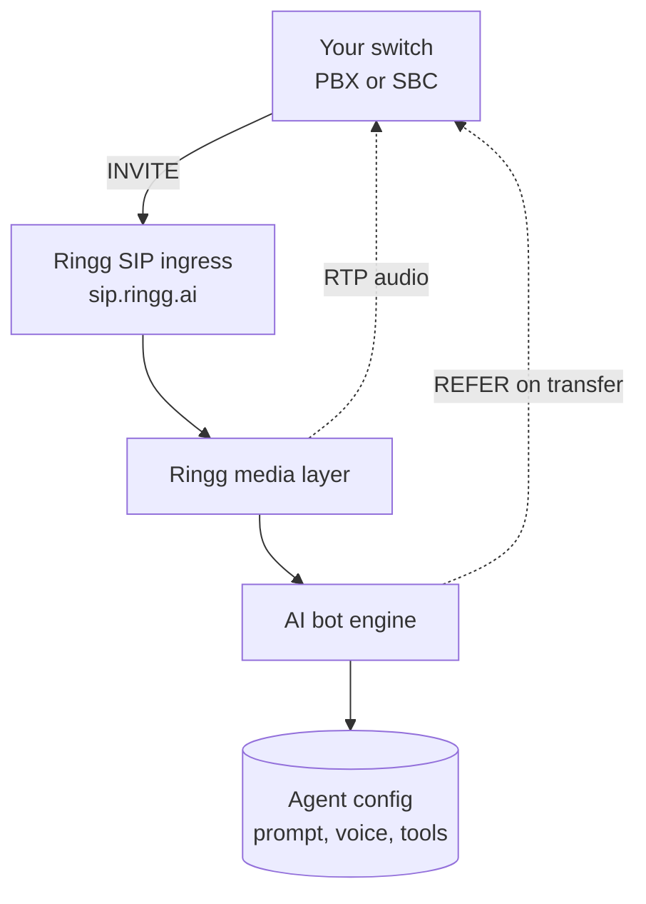
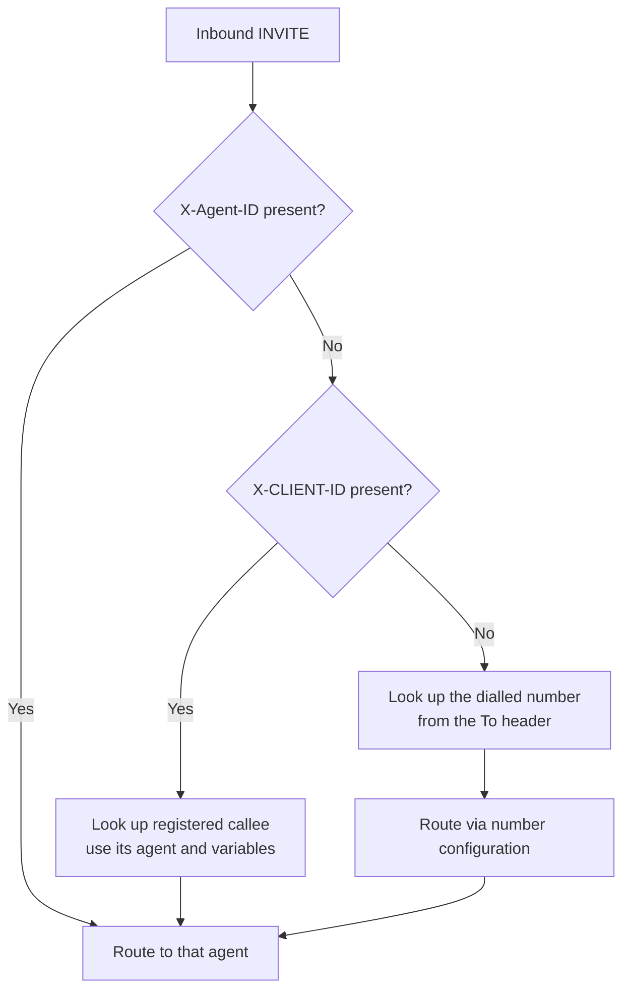
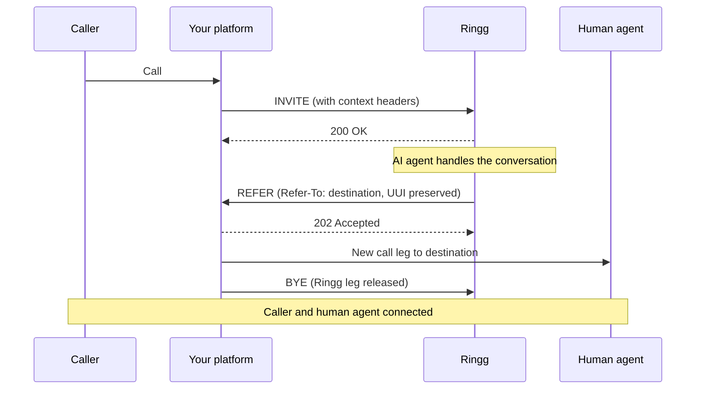

Your own voice platform (PBX, SBC or contact centre) talks to Ringg over standard <Tooltip tip="Session Initiation Protocol: the standard for connecting voice calls between phone systems.">SIP</Tooltip>, with no telephony provider in between: you keep your carrier and numbers, and Ringg supplies the agent that handles the conversation ([bring your own telephony](/documentation/inventory/phone-numbers/your-own-telephony/byot-overview)). A trunk works in two directions:

- **Inbound**: your switch sends an INVITE to Ringg. Ringg answers, picks the agent and runs the conversation.
- **Outbound**: Ringg sends an INVITE to your trunk, and your platform routes the call to the customer.

## Before you start

<Columns cols={2}>
  <Card title="An agent" icon="bot" href="/documentation/build-agents/agents/create-an-agent" horizontal>
    The agent that answers inbound INVITEs or places outbound calls over the trunk.
  </Card>
  <Card title="An API key" icon="key" href="/documentation/manage-account/api-key" horizontal>
    Optional: only to register inbound callees by API.
  </Card>
</Columns>

## What each side provides

| Ringg gives you | You give Ringg |
| --- | --- |
| A SIP ingress IP and ports | Your signalling IP or CIDR, so we can allowlist it |
| An RTP media range to allow through your firewall | Your trunk host and port for outbound calls |
| Agent routing by header or dialled number | Optional SIP auth credentials, if you do not use IP auth |
| Context injection through SIP headers | The transfer destination, if you use call transfer |

## Set up the trunk in the dashboard

Enterprise workspaces configure SIP trunks themselves: **Numbers → Add number**, select **SIP**, then open **Configure provider** (the gear) to reach the **Configure SIP Trunks** panel. With no trunk yet, the panel opens on the Add form. **SIP** isn't offered on the Saudi Arabia or UAE regional dashboards; there, and for other workspaces, [contact Ringg](#onboarding-checklist).

<Frame caption="Every trunk field, saving, and the trunk appearing in the list">
  <video alt="Every trunk field, saving, and the trunk appearing in the list" aria-label="Every trunk field, saving, and the trunk appearing in the list" controls muted playsInline className="w-full rounded-xl" style={{ aspectRatio: "16 / 10" }} preload="metadata" controlsList="nodownload noremoteplayback" poster="/media/telephony-sip/poster.webp">
    <source src="/media/telephony-sip/video.webm" type='video/webm; codecs="av01.0.09M.08"' />
  </video>
</Frame>

<Steps>
  <Step title="Add a trunk">
    In **Configure SIP Trunks**, select **Add** and fill in the trunk:

    | Field | Shown for | Notes |
    |---|---|---|
    | **Name** | All | Required. |
    | **Direction** | All | **Inbound** (default), **Outbound** or **Both**. |
    | **Inbound sources** | Inbound, Both | Public IPv4 addresses or CIDR blocks, `/18` or narrower, that your INVITEs come from. Add at least one. A range that overlaps another trunk's is refused. |
    | **Outbound target** | Outbound, Both | `host:port` where Ringg sends INVITEs. The port is required. |
    | **Tech prefix** | Outbound, Both | Optional. Prepended to the dialled number; 1–16 characters (A–Z, 0–9, `#`, `*`). |
    | **Strip digits** | Outbound, Both | Optional. Removes this many leading characters (0–20) from the dialled number; the `+` counts as one. |
    | **Transport** | All | **UDP** (default), **TCP** or **TLS**. |
    | **Authentication** | All | Off by default. See below. |

    <Frame caption="A trunk with direction Both: inbound sources, outbound target, tech prefix, strip digits">
      
    </Frame>

    With **Authentication** on, choose the **Auth mode**: **Register** (periodic REGISTER to your platform; needs direction **Outbound** or **Both**) or **Digest** (answers 401 challenges on outbound INVITEs). Then enter **Username**, **Password** and optionally **Realm** (defaults to the outbound host). Register also takes **Expires (seconds)**, 60 to 86400 (default 3600), and **Register delay (seconds)**, 0 to 3600 (default 0).

    <Frame caption="The Authentication fields for Register mode">
      
    </Frame>
  </Step>
  <Step title="Save">
    <Check>"SIP trunk created successfully." appears and the trunk is listed. Use the pencil to edit it or the trash icon to delete it.</Check>

    <Frame caption="Configure SIP Trunks after saving">
      
    </Frame>
  </Step>
  <Step title="Add your numbers">
    With the trunk selected in **Add number**, type your numbers on the **Add custom** tab. See [Add a number by hand](/documentation/inventory/phone-numbers/buy-or-import-a-number#add-a-number-by-hand). Then [attach them to agents](/documentation/inventory/phone-numbers/inbound-agent-number) or use them as caller ID.
  </Step>
</Steps>

## Network requirements

### SIP signalling

| Setting | Value | Media |
| --- | --- | --- |
| SIP domain (FQDN) | `sip.ringg.ai` | |
| UDP | `5060` | Plain RTP |
| TCP | `5060` | Plain RTP |
| TLS | `5061` | SRTP |

```text
sip:sip.ringg.ai:5060          UDP or TCP
sips:sip.ringg.ai:5061         TLS
```

Use `sip.ringg.ai` as the destination in your trunk configuration. Ringg shares the underlying ingress and media IP addresses with you during onboarding, for your firewall and ACL rules.

Media encryption follows the signalling transport, and is not configured separately. Connect over TLS on 5061 and the media is negotiated as SDES-SRTP (`RTP/SAVP`) using the `AES_CM_128_HMAC_SHA1_80` cipher suite. Connect over UDP or TCP on 5060 and the media is plain RTP. If you require encrypted media, use TLS. There is no option to run SRTP over a plaintext signalling transport.

<Warning>
For TLS, always connect to `sips:sip.ringg.ai:5061` rather than to the IP address. The certificate is issued for the hostname `sip.ringg.ai`, so a client that connects by IP and validates the certificate will fail on a hostname mismatch.
</Warning>

### RTP media

Media is bridged on the same address as signalling.

| Setting | Value |
| --- | --- |
| RTP IP | Shared during onboarding |
| RTP ports | `10000` to `60000` UDP |
| Encryption | SDES-SRTP on TLS trunks, plain RTP on UDP and TCP trunks |

<Warning>
The most common cause of a connected call with no audio is a firewall that permits SIP on 5060 but blocks the RTP range. Allow UDP `10000-60000` in both directions to the Ringg media addresses before testing.
</Warning>

### Codecs

| Codec | Support |
| --- | --- |
| G.711 u-law (PCMU) | Supported |
| G.711 a-law (PCMA) | Supported |

### Session timers

Ringg supports RFC 4028 session timers with a minimum `Session-Expires` of **1800 seconds**. A shorter value is rejected with `422 Session Interval Too Small`. Either raise the value on your side or omit the header.

## How a call flows



Ringg terminates the SIP leg, bridges the audio into the AI bot engine, and runs the conversation using the agent configuration resolved from the call. If the agent decides to hand the call to a human, Ringg sends a SIP REFER back to your platform.

## Inbound: your platform to Ringg

### Allowlisting

Ringg authenticates inbound calls by **source IP**. Send Ringg the signalling IP or CIDR your platform originates from, and it is added to the inbound ACL.

Ringg accepts public IPv4 addresses and CIDR blocks up to `/18`; anything broader, IPv6 and private ranges are rejected. If your carrier publishes a wider egress pool, send the specific ranges you originate from.

### Custom SIP headers

Ringg reads these headers from the inbound INVITE. All are optional except where your chosen routing method requires them.

| Header | Purpose | Example |
| --- | --- | --- |
| `X-Agent-ID` | Route directly to a specific AI agent | `11111111-2222-4333-8444-555555555555` |
| `X-Workspace-ID` | Identifies your Ringg workspace | `aaaaaaaa-bbbb-4ccc-8ddd-eeeeeeeeeeee` |
| `X-CLIENT-ID` | Per-user lookup against your registered callees | `+919XXXXXXXXX` |
| `X-Custom-Vars` | Key and value pairs injected into the conversation | `customer_name=Ravi Kumar&account_id=ACC-9910` |
| `X-Call-ID` | Your own call identifier, used for tracking instead of the SIP Call-ID | `enterprise-call-001` |
| `User-to-User` | RFC 7433 UUI payload, used by Genesys and similar platforms | See [Genesys Cloud](#genesys-cloud-byoc) |

Example INVITE:

```http
INVITE sip:+919XXXXXXXXX@sip.ringg.ai SIP/2.0
X-Agent-ID: 11111111-2222-4333-8444-555555555555
X-Workspace-ID: aaaaaaaa-bbbb-4ccc-8ddd-eeeeeeeeeeee
X-Custom-Vars: customer_name=Ravi Kumar&account_id=ACC-9910
X-Call-ID: enterprise-call-001
```

### Choosing which agent answers

Ringg resolves the agent in this order: `X-Agent-ID` first, then `X-CLIENT-ID`, then the dialled number.



| Method | Use it when |
| --- | --- |
| `X-Agent-ID` | Your platform already knows which agent should handle the call. Ringg routes straight to it and skips every lookup. |
| `X-CLIENT-ID` | You registered the caller ahead of time as an [inbound callee](#inbound-callees). Ringg uses the agent and variables stored on that record. |
| Dialled number | Neither header is present. Ringg takes the number from the To header or Request-URI and routes by that number's configuration in your workspace ([Attach a number](/documentation/inventory/phone-numbers/inbound-agent-number)). |

## Passing context into the conversation

Context lets the agent open the call already knowing who it is speaking to, instead of asking.

### X-Custom-Vars

`X-Custom-Vars` carries an `&` separated list of `key=value` pairs:

```http
X-Custom-Vars: customer_name=Ravi Kumar&account_id=ACC-9910&loan_amount=50000
```

### Using the values

Every key becomes available in the agent's system prompt and intro message as `@{{key}}`:

```text
System prompt:
  You are speaking to @{{customer_name}} about account @{{account_id}}.

Intro message:
  Hello @{{customer_name}}, this is Ringg calling about your loan of @{{loan_amount}}.
```

Keep values short and avoid characters that need escaping in a SIP header. `&` and `=` are the separators in `X-Custom-Vars`, so a value containing either does not parse.

## Genesys Cloud (BYOC)

Genesys Cloud BYOC trunks do not generally send `X-Custom-Vars`. They carry call context in the standard RFC 7433 **User-to-User** header instead, and Ringg supports that natively.

### The header

```http
User-to-User: 00637573746f6d65725f6e616d653d5261...;encoding=hex;purpose=isdn-uui;content=isdn-uui
```

### Encoding

| Property | Detail |
| --- | --- |
| Encoding | Hex, declared with `encoding=hex` |
| Leading byte | `00` protocol discriminator, stripped by Ringg |
| Payload | Once decoded, an `&` separated `key=value` string, the same shape as `X-Custom-Vars` |
| Multiple headers | Ringg reads up to 8 `User-to-User` header instances and concatenates them |

A decoded payload looks like this:

```text
customer_name=Ravi Kumar&account_id=ACC-9910&ticket_id=TKT-4471&lang=en-in&priority=high
```

### What Ringg does with it

1. Reads every `User-to-User` header on the inbound INVITE.
2. Decodes the hex payload and removes the leading `00` discriminator.
3. Makes each decoded key a conversation variable, usable as `@{{key}}` exactly like `X-Custom-Vars`.
4. On transfer, puts the UUI back on the `Refer-To` URI so your platform keeps the same context on the onward leg.

### Keep the UUI small

Keep the UUI payload under roughly 150 bytes: send identifiers such as a ticket or conversation ID rather than free text, and look up the detail on your side after the transfer completes.

<Warning>
UUI content is hex encoded, so every byte of payload becomes two characters on the wire; a 200 byte payload is a 400 character header. On transfer that header travels inside the `Refer-To` URI of the REFER, and a large UUI can push the REFER past the 1500 byte MTU into IP fragmentation. Some SBCs and firewalls silently drop fragments, and the transfer fails with no useful error.
</Warning>

## Outbound: Ringg to your trunk

For outbound calls, Ringg originates the INVITE toward your platform from a fixed set of source addresses. Ringg provides these during onboarding, and you allow them in your inbound firewall and SIP ACL.

### What Ringg needs from you

| Item | Required | Notes |
| --- | --- | --- |
| Public host or IP | Required | The address Ringg sends the INVITE to |
| Port | Required | Typically `5060`, or `5061` for TLS |
| Transport | Required | `udp`, `tcp`, or `tls` |
| Auth method | Optional | IP based, digest, or register. See below |
| Username and password | Only for digest or register | Not needed for IP based auth |
| Realm | Optional | Only if your platform challenges with a realm different from its host |

### Authentication modes

IP based is the simplest and recommended where your platform supports it.

| Mode | How it works |
| --- | --- |
| IP based | You allowlist the Ringg source addresses on your side; no credentials are exchanged. |
| Digest | Your platform challenges the INVITE with `401` or `407` and Ringg answers with the username and password you supply. |
| REGISTER | Ringg registers to your platform on an interval with the credentials you supply, and your platform routes calls to that registration. |

With digest or register, send the exact realm your platform challenges with when it differs from its hostname. A realm mismatch makes registration or authentication fail silently and retry indefinitely, with no calls connecting.

## Call transfer with SIP REFER

When the AI agent needs to hand the call to a human or another destination, Ringg sends a **SIP REFER** on the existing dialog. Your platform performs the actual transfer.



### What your platform must support

| Requirement | Detail |
| --- | --- |
| `REFER` method | Advertise `REFER` in your `Allow` header |
| `Refer-To` | Accept the destination Ringg supplies, as a SIP or SIPS URI |
| `Referred-By` | Sent by Ringg per RFC 3892 |
| `202 Accepted` | Expected response to the REFER |

### Behaviour to expect

- Many platforms send their own BYE to release the Ringg leg as soon as they accept the REFER. Ringg does not treat this as an error.
- A UUI received on the inbound call travels on the `Refer-To` URI ([keep it small](#keep-the-uui-small)). If your transfer destinations carry large UUI payloads, prefer TCP or TLS for the trunk: UDP requests above roughly 1300 bytes are prone to fragmentation, which some networks drop.

## Inbound callees

An **inbound callee** is a record you register with Ringg ahead of time: when this person calls in, use this agent and start the conversation already knowing these facts about them. Use it when your platform cannot attach per-customer context to every INVITE: upload the context once, keyed by the caller's identifier, and at call time send only `X-CLIENT-ID`.

Each record stores:

- The `user_id` that `X-CLIENT-ID` is matched against, usually the caller's number
- The `agent_id` that should handle the call
- Any custom variables to inject into the prompt and intro message

Records are upserted: uploading a `user_id` that already exists overwrites its configuration, so you can re-upload the full list on a schedule. Transliteration runs only when the request carries `agent_id`.

The endpoints below live under `https://prod-api.ringg.ai/ca/api/v0` and take your workspace [API key](/documentation/manage-account/api-key) in the `X-API-KEY` header on its own; a request that also carries an `Authorization` header is rejected. The key identifies the workspace, so no workspace ID is needed.

### Upload via CSV

```text
POST /ca/api/v0/inbound-callees/upload
X-API-KEY: $RINGG_API_KEY
Content-Type: multipart/form-data
```

| Field | Type | Required | Description |
| --- | --- | --- | --- |
| `csv_file` | file | Required | CSV file containing the callee rows |
| `column_mapping` | JSON string | Required | Maps Ringg field names to your CSV column names, `{"ringg_field": "csv_column"}`. Must include `user_id` ([worked example below](#upload-via-csv)) |
| `agent_id` | string (UUID) | Optional | Assigns one agent to every callee in the upload |
| `transliterate_callee_name` | bool | Optional | Transliterates `callee_name` into the agent's language |
| `transliterate_fields` | JSON array | Optional | Additional fields to transliterate, by agent variable name |

<CodeGroup>
```csv callees.csv
phone,name,acc_no
+919XXXXXXXXX,Ravi Kumar,ACC-9910
+919YYYYYYYYY,Priya Sharma,ACC-1122
```

```bash Upload
curl -X POST https://prod-api.ringg.ai/ca/api/v0/inbound-callees/upload \
  -H "X-API-KEY: $RINGG_API_KEY" \
  -F "csv_file=@callees.csv" \
  -F 'column_mapping={"user_id":"phone","callee_name":"name","account_id":"acc_no"}' \
  -F "agent_id=11111111-2222-4333-8444-555555555555"
```
</CodeGroup>

The mapping key is the Ringg field name, the value is your CSV column heading:

| `column_mapping` entry | Reads CSV column | Becomes Ringg field | Used in the agent as |
| --- | --- | --- | --- |
| `"user_id": "phone"` | `phone` | `user_id` | matched against `X-CLIENT-ID` |
| `"callee_name": "name"` | `name` | `callee_name` | `@{{callee_name}}` |
| `"account_id": "acc_no"` | `acc_no` | `account_id` | `@{{account_id}}` |

Your CSV headings can be named anything; only the left side of the mapping has to match the variable names your agent expects. `transliterate_fields` matches on those same left-side names: with the mapping above, transliterating the customer's name means passing `["callee_name"]`, not `["name"]`. A value that matches no variable name is silently ignored.

### Upload via JSON

```text
POST /ca/api/v0/inbound-callees/upload-json
X-API-KEY: $RINGG_API_KEY
Content-Type: application/json
```

| Field | Type | Required | Description |
| --- | --- | --- | --- |
| `callees` | array of objects | Required | Each object needs `user_id`. Every other key becomes a custom variable, stored as a string |
| `agent_id` | string (UUID) | Optional | Applies to all callees, and overrides any `agent_id` set on a callee object |
| `transliterate_callee_name` | bool | Optional | Transliterates `callee_name` |
| `transliterate_fields` | array of strings | Optional | Additional fields to transliterate. Use the **agent variable names**, the same keys you set on each callee object |

```json
{
  "agent_id": "11111111-2222-4333-8444-555555555555",
  "callees": [
    {
      "user_id": "+919XXXXXXXXX",
      "callee_name": "Ravi Kumar",
      "account_id": "ACC-9910",
      "loan_amount": "50000"
    },
    {
      "user_id": "+919YYYYYYYYY",
      "callee_name": "Priya Sharma",
      "account_id": "ACC-1122"
    }
  ]
}
```

### Upload response

Both endpoints return the same shape:

```json
{
  "created_count": 2,
  "failed_rows": [
    { "line_number": 4, "error": "user_id is required" }
  ]
}
```

| Field | Description |
| --- | --- |
| `created_count` | Number of records created or updated |
| `failed_rows` | Skipped rows, with a 1 based line number and the reason |

### List callees

```text
GET /ca/api/v0/inbound-callees
X-API-KEY: $RINGG_API_KEY
```

| Parameter | Type | Description |
| --- | --- | --- |
| `limit` | int, 1 to 100, default 10 | Page size |
| `offset` | int, default 0 | Page offset |
| `user_id` | string | Filter by exact user_id |
| `agent_id` | string (UUID) | Filter by agent |
| `start_date` | ISO 8601 date, UTC | Created on or after |
| `end_date` | ISO 8601 date, UTC | Created on or before |

The response is `{"data": [...], "limit", "offset", "count", "total"}`; each item has `id`, `workspace_id`, `user_id`, `agent_id` and `custom_args_values`.

## Troubleshooting

| Symptom | Likely cause | Resolution |
| --- | --- | --- |
| `403` or call rejected at Ringg | Your signalling IP is not allowlisted | Send Ringg the exact source IP or CIDR you originate from |
| `422 Session Interval Too Small` | `Session-Expires` below 1800 s | Raise it to 1800 s or more, or omit the header |
| TLS handshake fails or certificate is rejected | Connecting to the IP instead of the hostname | Use `sips:sip.ringg.ai:5061`. The certificate is issued for `sip.ringg.ai`, not for the IP |
| Call connects but there is no audio | RTP range blocked | Allow UDP `10000-60000` to and from the Ringg media addresses |
| No audio on a TLS trunk specifically | SRTP not offered, or an unsupported cipher suite | Ringg negotiates SDES-SRTP with `AES_CM_128_HMAC_SHA1_80`. Confirm your SBC offers `RTP/SAVP` with that suite, and that DTLS is not being forced |
| Agent does not answer as expected | `X-Agent-ID` missing or invalid | Confirm the UUID is correct and the agent is published |
| Context variables are empty | `X-Custom-Vars` malformed, or UUI not hex encoded | Check the `&` and `=` separators, and that `encoding=hex` is present |
| Callee lookup fails | `X-CLIENT-ID` does not match any `user_id` | Confirm the number format matches exactly what was uploaded |
| Transfer never completes | REFER not supported, or REFER too large and fragmented | Advertise `REFER` in `Allow`, shrink the UUI, and prefer TCP or TLS |
| Outbound calls never connect | Realm mismatch on digest or register auth | Send Ringg the exact realm your platform challenges with |

## Onboarding checklist

<Steps>
  <Step title="Configure the trunk, or contact Ringg">
    Enterprise workspaces [set up the trunk in the dashboard](#set-up-the-trunk-in-the-dashboard). Otherwise, email [admin@ringg.ai](mailto:admin@ringg.ai) requesting a SIP integration, with these details so the trunk can be provisioned in one pass:

    - Company name and your Ringg workspace
    - Direction needed: inbound, outbound, or both
    - Your SIP signalling IP or CIDR, for the [inbound allowlist](#allowlisting)
    - For outbound, [what Ringg needs from you](#what-ringg-needs-from-you): trunk host, port, transport and authentication, with the exact realm for digest or register
    - Whether the agent needs to transfer calls, and the destination to transfer to
    - How you will pass context: `X-Custom-Vars`, or the `User-to-User` header if you are on Genesys Cloud

    Ringg confirms the allowlist entry and returns your trunk configuration with the addresses for your firewall.
  </Step>
  <Step title="Apply your firewall rules">
    Point your trunk at `sip.ringg.ai` and allow the addresses Ringg provided on the [signalling and RTP ports](#network-requirements), in both directions.
  </Step>
  <Step title="Decide routing, context and transfer">
    Pick how the [agent is chosen](#choosing-which-agent-answers) and how [context is passed](#passing-context-into-the-conversation). If the agent will hand off to a human, confirm your platform accepts [REFER](#call-transfer-with-sip-refer) and agree the destination.
  </Step>
  <Step title="Run a test call">
    Place a call in each enabled direction.
    <Check>Two-way audio, the right agent answers, injected variables appear in the conversation, and the transfer lands. The call is in [Logs](/documentation/monitor/logs).</Check>
  </Step>
</Steps>

## Next steps

<Columns cols={2}>
  <Card title="Add the trunk's numbers" icon="hash" href="/documentation/inventory/phone-numbers/buy-or-import-a-number#add-a-number-by-hand">
    Type them in on the **Add custom** tab.
  </Card>
  <Card title="Attach a number to an agent" icon="phone-incoming" href="/documentation/inventory/phone-numbers/inbound-agent-number">
    Route dialled-number calls to an agent.
  </Card>
</Columns>
