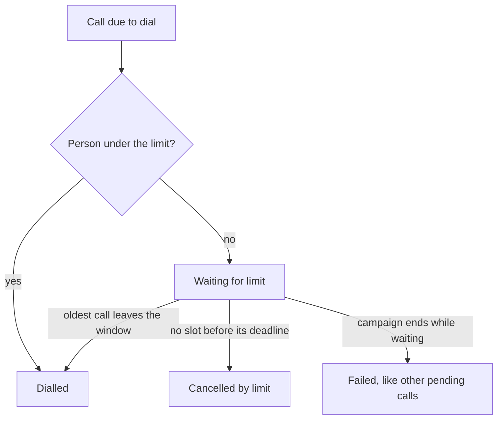

Use a call limit when several campaigns, workflows and retries can reach the same number, so nobody is called too often: 3 calls in 24 hours, for example.

In the dashboard: **Settings → Call limits**.

## Before you start

<Columns cols={2}>
  <Card title="The right workspace" icon="layout-grid" href="/documentation/manage-account/ringg-spaces/overview" horizontal>
    In a family, each Ringg Space sets its own limit.
  </Card>
  <Card title="Outbound calls to limit" icon="megaphone" href="/documentation/deploy/campaigns/create-a-campaign" horizontal>
    Only outbound calls are limited; see [What counts](#what-counts).
  </Card>
</Columns>

## Set the workspace limit

A new workspace has the limit off; switching it on without other changes applies the defaults in the table below.

<Frame caption="Setting a limit of 3 calls in 24 hours and saving it">
  <video alt="Setting a limit of 3 calls in 24 hours and saving it" aria-label="Setting a limit of 3 calls in 24 hours and saving it" controls muted playsInline className="w-full rounded-xl" style={{ aspectRatio: "16 / 10" }} preload="metadata" controlsList="nodownload noremoteplayback" poster="/media/account-call-limits/poster.webp">
    <source src="/media/account-call-limits/video.webm" type='video/webm; codecs="av01.0.09M.08"' />
  </video>
</Frame>

<Steps>
  <Step title="Turn it on">
    Switch on **Limit how often one person is called**.
  </Step>
  <Step title="Set the maximum and the window">
    Enter **Maximum calls to one person** and pick a **Rolling window**; the options are in the table below.
  </Step>
  <Step title="Check the impact">
    The **Projected impact** panel shows what these values would have held back (see [below](#projected-impact)). **See an example** walks through one person's calls under the rule.
    <Frame caption="A limit of 3 calls in 24 hours, with its projected impact">
      
    </Frame>
  </Step>
  <Step title="Save">
    Click **Save**. If the change switches the limit on or makes it stricter, the **This affects calls already queued** dialog explains that it applies from the next dial, including calls your running campaigns and workflows have already lined up. Click **Save limit**. Loosening the limit or switching it off saves without the dialog, and does not release waiting calls early: each one dials at its scheduled time if the new limit allows.
    <Frame caption="The confirmation before a stricter limit saves">
      
    </Frame>
    <Check>The switch stays on with your values. Calls over the limit show **Waiting for limit** in [Logs](/documentation/monitor/logs#call-statuses).</Check>
  </Step>
</Steps>

| Setting | Options | Default |
|---|---|---|
| **Limit how often one person is called** | On / off | Off |
| **Maximum calls to one person** | 1 to 50 | 5 |
| **Rolling window** | 30 minutes; 1, 2, 4, 6, 12, 24, 48 or 72 hours; 5 or 7 days | 24 hours |

## How a call limit works

The limit counts calls to the same person across every [agent](/documentation/build-agents/agents/agent-types) in the workspace, within a <Tooltip tip="A window that moves with time: at any moment it covers the last N hours or days.">rolling window</Tooltip>. A call that would go over the limit waits and dials once the oldest counted call leaves the window, within calling hours. It can wait only until its deadline:

| Call from | Deadline |
|---|---|
| A campaign | The campaign's end time; extending the campaign extends it |
| The API | `call_deadline` or `call_validity_hours`, whichever comes first |
| A workflow call step | The end time of the workflow campaign that started the run; none for other runs |

If the next free slot falls after the deadline, the call is cancelled at once (**Cancelled by limit**). A call with no deadline, such as an API call sent without either field, is cancelled as soon as it reaches the limit.

With a limit of 3 calls in 24 hours:

| Call | Result |
|---|---|
| 1, from Agent A | Dialled. 1 of 3 used. |
| 2, from Agent B | Dialled. 2 of 3 used. |
| 3, from Agent A | Dialled. 3 of 3 used; the limit is reached. |
| 4, from any agent | Waits until call 1 is more than 24 hours old, then dials within calling hours. |

A call still waiting when its campaign ends fails like the campaign's other pending calls, not as **Cancelled by limit**.

## What counts

The limit applies to outbound calls from [campaigns](/documentation/deploy/campaigns/overview), [workflows](/documentation/build-agents/workflows/overview), direct calls (including calls placed through the API), callbacks and retries, listed on the page under **Where this applies**.

- Each retry attempt counts as a call. Being held does not use up a retry.
- Callbacks always dial but still count, so one can push someone past the limit.
- [Test calls](/documentation/build-agents/test-and-improve/test-an-agent) and inbound calls are never counted.
- Calls sent with `purpose: "transactional"` are never held or cancelled by the limit.

## Projected impact

The **Projected impact** panel replays your recent outbound calls against the values in the form and updates as you edit them. It works while the limit is off too.

| Figure | Meaning |
|---|---|
| **Would be held** | Recent calls this limit would have held, out of how many calls to how many people in the period checked |
| **Share of those calls** | The same as a percentage |

The projection counts retries once, so a live limit holds back slightly more than it shows. If Ringg can match the person on fewer than 60% of recent dials, the panel shows "Not enough recent calls to project this reliably" instead of a figure.

## Per-agent limits

An outbound agent can have a stricter limit of its own: in the agent editor, open **Call** and find **Call limits** ("How often this agent may call the same person"). See [Call settings](/documentation/build-agents/customize-agent-behaviour/call-settings#call-limits).

- **Maximum calls to one person** offers **No limit** (follow the workspace limit) or a number up to the workspace maximum. The agent limit uses the workspace's window.
- An agent limit can only tighten the workspace limit. With the workspace limit off, the field is disabled and shows "An agent limit can only tighten the workspace limit."; its **Set limit** link brings you here.
- A call waits for whichever limit it reaches first.

An agent with its own limit shows a call-limit chip on its row in the **Assistants** list. When a limit applies, a campaign's settings step shows it in a read-only **Call limits** card ([Create a campaign](/documentation/deploy/campaigns/create-a-campaign)).

## Call limits in Ringg Spaces

Each [Ringg Space](/documentation/manage-account/ringg-spaces/overview) sets its own limit, and a primary's limit never reaches its Ringg Spaces. A primary with Ringg Spaces places no calls itself, so **Call limits** is missing from its Settings menu, and opening the page directly shows "Set in each Ringg Space".

## Find held calls

- In [Logs](/documentation/monitor/logs#call-statuses), a held call shows **Waiting for limit** and a cancelled one **Cancelled by limit**.
- In [Analytics](/documentation/monitor/analytics#call-limits), the **Call limits** section counts **Waiting for limit reset**, **Dialled after waiting**, **Cancelled, deadline passed** and **Cancelled, campaign ended**.

The public API has no endpoint for call limits; set them in the dashboard. An API call over the limit is still accepted with `200`, because the limit is checked just before dialling. [Get Call Details](/api-reference/endpoint/history/get-call-details) then shows `call_sub_status` `FREQUENCY_DEFERRED` while the call waits, or `call_status` `cancelled` with `call_sub_status` `FREQUENCY_CAPPED` once the limit cancels it. No `call_completed` event is sent for a cancelled call.

## Troubleshooting

<AccordionGroup>
  <Accordion title="A campaign is running slower than expected">
    Some contacts may be at the limit. Look in [Logs](/documentation/monitor/logs) for **Waiting for limit**, or loosen the limit here.
  </Accordion>
  <Accordion title="I can't pick a number in the agent's Call limits field">
    The workspace limit is off. Switch it on here first.
  </Accordion>
  <Accordion title="Call limits is missing from Settings">
    You are on a primary workspace with Ringg Spaces. Switch to a Ringg Space and set the limit there.
  </Accordion>
  <Accordion title="The page says We couldn't load the call limit">
    Click **Try again**. Nothing has changed; the current limit stays in force either way.
  </Accordion>
</AccordionGroup>

## Next steps

<Columns cols={2}>
  <Card title="Set an agent's limit" icon="bot" href="/documentation/build-agents/customize-agent-behaviour/call-settings#call-limits">
    Tighten the limit for one outbound agent.
  </Card>
  <Card title="Plan retries for a campaign" icon="megaphone" href="/documentation/deploy/campaigns/create-a-campaign">
    Retries and calling hours are set per campaign.
  </Card>
</Columns>
