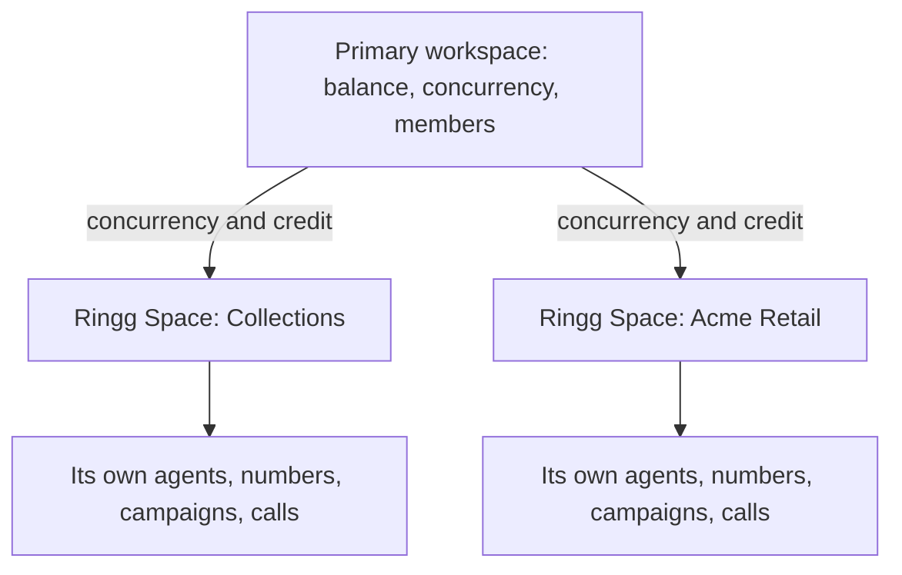

Use Ringg Spaces when you run Ringg for several clients, brands or teams and want their work kept apart but paid for in one place.

In the dashboard: **Settings → Sub-workspaces**. Any member of a primary or standalone workspace can open it; it never appears inside a Ringg Space.

## Before you start

<Columns cols={2}>
  <Card title="Ringg Spaces enabled by Ringg" icon="mail" href="mailto:admin@ringg.ai" horizontal>
    Ringg turns it on per customer. Ask through **Contact us** in Settings.
  </Card>
  <Card title="The primary workspace's API key" icon="key" href="/documentation/manage-account/api-key" horizontal>
    Optional: only to manage the family by API.
  </Card>
</Columns>

## How a family works

What each side holds:

| | Primary workspace | Ringg Space |
|---|---|---|
| Purpose | Manages the family: money, concurrency, members and access | Does the work: [agents](/documentation/build-agents/agents/create-an-agent), [numbers](/documentation/inventory/phone-numbers/buy-or-import-a-number), [campaigns](/documentation/deploy/campaigns/create-a-campaign), calls |
| Sidebar | Only **Logs**, **Analytics**, **Alerts** and **Settings** | The full product |
| Balance and invoices | Holds them. **Add Balance**, coupons and **Pay Dues** happen here. | Uses the primary's ("Balance is shared with" or "Billing is handled by" the primary) |
| Concurrency | Bought here on [Billing](/documentation/manage-account/billing), then shared out | Allocated from the primary's capacity |
| [Call limits](/documentation/manage-account/call-limits) | Not set here | Set in each Ringg Space |
| API key | Its own; manages the family over the API | Its own; works only inside that Ringg Space |
| Members | Have access to the primary and every Ringg Space, including ones created later | Direct members see only this Ringg Space ([Direct and Inherited](/documentation/manage-account/members#members-in-ringg-spaces-direct-and-inherited)) |

A family has one of two billing modes:

- **Individual billing**: each Ringg Space has its own balance (prepaid) or credit limit (postpaid), set from the primary. A family you create uses this mode.
- **Common billing**: the whole family shares the primary's balance or credit limit. Ringg sets this up; contact Ringg to switch. A switch goes from individual to common only.

Once a primary has a Ringg Space, it becomes a management hub. Its [Logs](/documentation/monitor/logs#filter-the-list) and [Analytics](/documentation/monitor/analytics) have a workspace filter covering every Ringg Space, so you read the whole family's calls in one place. Switch workspaces with the workspace switcher, the first item in the top bar.

## Troubleshooting

<AccordionGroup>
  <Accordion title="Ringg Spaces is not in my Settings menu">
    Either the feature is off for your account, or you are inside a Ringg Space. Switch to the primary, or ask Ringg to turn the feature on.
  </Accordion>
  <Accordion title="Assistants, Campaigns and Numbers disappeared from the sidebar">
    You are on the primary workspace, which keeps only Logs, Analytics, Alerts and Settings once it has Ringg Spaces. Switch to a Ringg Space to build and run agents.
  </Accordion>
  <Accordion title="I can't add balance inside a Ringg Space">
    Balance belongs to the primary. Top up there, then give the Ringg Space its share from **Manage → Billing**.
  </Accordion>
  <Accordion title="I can't change a member's permissions in a Ringg Space">
    Their row is **Inherited**. Change their access in the primary workspace.
  </Accordion>
</AccordionGroup>

## Next steps

<Columns cols={2}>
  <Card title="Buy concurrency" icon="wallet" href="/documentation/manage-account/billing#change-concurrency">
    Raise the family's capacity on the primary.
  </Card>
  <Card title="Invite members" icon="users" href="/documentation/manage-account/members">
    Grant access to the primary or one Ringg Space.
  </Card>
</Columns>
