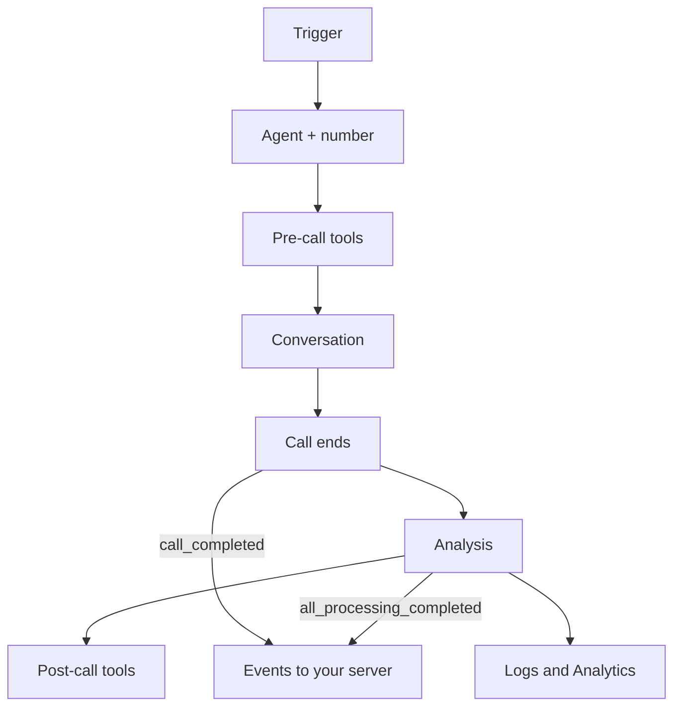

Ringg is built from a few objects. An agent does the talking, a number connects it to the phone network, and a call, campaign or workflow decides who it talks to and when. Read this before building so the dashboard's sections make sense; the [dashboard tour](/get-started/dashboard-tour) shows where each one lives.

## The core objects

| Object | What it is and where to find it |
|---|---|
| [Workspace](/documentation/manage-account/members) | Holds everything below, plus members, the API key and billing. A primary workspace can hold [Ringg Spaces](/documentation/manage-account/ringg-spaces/overview). Dashboard: the workspace switcher in the top bar. |
| [Agent](/documentation/build-agents/agents/agent-types) | An AI assistant with a prompt, a voice, variables, knowledge and tools. Single-prompt or multi-prompt. Dashboard: **Assistants**. |
| [Number](/documentation/inventory/phone-numbers/overview) | A phone line. Inbound agents answer on it; outbound calls show it as the caller ID. Dashboard: **Inventory → Numbers**. |
| [Number pool](/documentation/inventory/phone-numbers/number-pools) | A group of numbers that outbound calls rotate across, skipping spam-flagged ones. Dashboard: **Numbers → Number Pools**. |
| [Call](/documentation/monitor/logs) | One conversation: a phone call, web call or WhatsApp chat, with an ID, a status, a transcript, analysis and, for voice, a recording. Dashboard: **Monitor → Logs**. |
| [Campaign](/documentation/deploy/campaigns/overview) | One agent calling a CSV list on a schedule. Each row becomes a call. Dashboard: **Monitor → Campaigns**. |
| [Workflow](/documentation/build-agents/workflows/overview) | A graph of steps run once per contact: calls, messages, waits, API requests and branches. Dashboard: **Workflows**. |
| [Knowledge base](/documentation/inventory/knowledge-base) | Files and web pages an agent looks up mid-conversation. Dashboard: **Inventory → Knowledge base**. |
| [Tools](/documentation/build-agents/customize-agent-behaviour/tools/overview) | API requests and actions that run before, during or after a call. Dashboard: agent editor → **Tools**; shared library in **Inventory → Tools**. |
| [Variables](/documentation/build-agents/customize-agent-behaviour/custom-variables) | Per-call values such as `callee_name`, filled from the API or a CSV column. Dashboard: agent editor → **Custom Variables**. |
| [Advanced Analysis](/documentation/build-agents/customize-agent-behaviour/advanced-analysis) | Fields extracted from every conversation, such as "payment promised" or a callback date. Dashboard: agent editor → **Advanced Analysis**. |
| [Event Subscription](/documentation/build-agents/customize-agent-behaviour/event-subscription) | Webhooks: requests to your server when call, chat or analysis events happen. Dashboard: agent editor → **Event Subscription**. |
| [API key](/documentation/manage-account/api-key) | The workspace's key, sent as `X-API-KEY`. One per workspace. Dashboard: **Settings → API key**. |

## How they connect

- A workspace owns its agents, numbers, knowledge bases, tools, campaigns and workflows. In a [Ringg Space family](/documentation/manage-account/ringg-spaces/overview), each Ringg Space owns its own; the primary keeps Logs, Analytics, Alerts and Settings for the whole family.
- An agent can use several [knowledge bases](/documentation/build-agents/customize-agent-behaviour/attach-a-knowledge-base) and [tools](/documentation/build-agents/customize-agent-behaviour/tools/overview).
- An inbound agent answers on the number [attached](/documentation/inventory/phone-numbers/inbound-agent-number) to it. An outbound agent has no fixed number: you pick a number or pool each time you place a call or start a campaign.
- A campaign combines one outbound agent, a number or pool, and a [calling list](/documentation/deploy/campaigns/calling-list).
- A workflow uses agents inside its steps, so one contact can get several conversations.
- Every call belongs to one agent. It shows in [Logs](/documentation/monitor/logs), counts in [Analytics](/documentation/monitor/analytics), can be scored in [Evals](/documentation/monitor/evals) and can trigger [Alerts](/documentation/monitor/alerts).

## The life of a call

Events reach your server twice: once when the call ends, and again when analysis is done.

1. **Trigger.** A [test](/documentation/build-agents/test-and-improve/test-an-agent) in the dashboard, an [API request](/api-reference/endpoint/calling/initiate-individual-call), a [campaign](/documentation/deploy/campaigns/overview) row, a [workflow](/documentation/build-agents/workflows/overview) step, a call to an attached number, a visitor in the [web widget](/documentation/deploy/web-and-apps/web-widget/overview), or a [WhatsApp](/documentation/build-agents/agents/whatsapp-agents/overview) message.
2. **Agent and number.** Ringg loads the agent. A voice call goes out from, or comes in on, a [number](/documentation/inventory/phone-numbers/overview).
3. **Pre-call tools** run before the call connects, so a CRM lookup is ready for the agent's first sentence.
4. **Conversation.** The agent follows its [prompt](/documentation/build-agents/customize-agent-behaviour/agent-prompt), looks things up in its knowledge base, and uses on-call tools such as a transfer or a booking API when the prompt says to.
5. **Call ends.** Ringg stores the transcript and, for voice, the recording.
6. **Analysis.** Ringg's platform analysis (summary, key points, action items, a classification of the call) and your [Advanced Analysis](/documentation/build-agents/customize-agent-behaviour/advanced-analysis) fields are extracted.
7. **Post-call tools and events.** Post-call tools push results to your systems. [Event Subscription](/documentation/build-agents/customize-agent-behaviour/event-subscription) sends each event as it happens, from `call_started` to `all_processing_completed`.
8. **Logs and Analytics.** The call shows in [Logs](/documentation/monitor/logs) and rolls up into [Analytics](/documentation/monitor/analytics).

## Dashboard and API

Everything can be built and run in the dashboard. The [API](/api-reference/introduction/authentication) covers agents, calls, campaigns, numbers, knowledge bases, call history, analytics and Ringg Spaces, so your backend can trigger calls and read results. Workflows and Alerts have no public API endpoints, and Evals are set up in the dashboard; use the dashboard for them.

## Next steps

<Columns cols={3}>
  <Card title="Take the lessons" icon="graduation-cap" href="/resources/learn/all-lessons">
    Build a payment-reminder system in the dashboard, lesson by lesson.
  </Card>
  <Card title="Pick an agent type" icon="bot" href="/documentation/build-agents/agents/agent-types">
    Choose a channel and a single- or multi-prompt structure.
  </Card>
  <Card title="Tour the dashboard" icon="panels-top-left" href="/get-started/dashboard-tour">
    Sign in, then find every section and the page that covers it.
  </Card>
</Columns>
