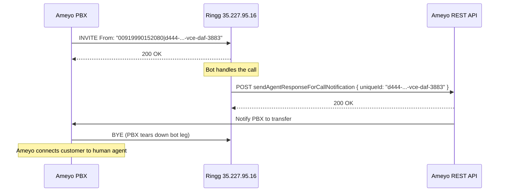

## Overview

This is an **inbound-only** integration. Ameyo sends all SIP INVITEs to Ringg. Ringg does not initiate calls back to Ameyo.

Ameyo connects to Ringg via a SIP trunk. Ringg handles the bot leg of the call. When the bot finishes, Ringg POSTs to Ameyo's REST API with the CRT Object ID. The REST API then notifies the Ameyo PBX, and the PBX sends BYE to tear down the bot call leg and routes the customer to a human agent.

## 1. SIP Setup

### Endpoint

Point your SIP gateway at:

```
35.227.95.16
Port 5060 (UDP/TCP)
```

### Firewall

Whitelist `35.227.95.16` on your SIP gateway for the following:

| Traffic | Port range |
|---|---|
| SIP signaling | 5060 (UDP/TCP) |
| RTP media | 10000 – 60000 (UDP) |

Share your source IPs with the Ringg team and we will whitelist them on our side.

### INVITE format

Routing is IP-based with no digest auth. Every INVITE must include:

- A `From` display name in the format `"<DID>|<CRT Object ID>"`
- The static `X-Workspace-ID` header provided by Ringg

```sip
INVITE sip:<extension>@35.227.95.16 SIP/2.0
From: "00919990152080|d444-69139d35-vce-daf-3883" <sip:<caller>@<your_ip>>;tag=...
To:   <sip:<extension>@35.227.95.16>
X-Workspace-ID: <workspace_id>
```

| Field | Example | Notes |
|---|---|---|
| From display name left of `\|` | `00919990152080` | DID. Use `00` prefix (not `+`). |
| From display name right of `\|` | `d444-69139d35-vce-daf-3883` | CRT Object ID. Ringg uses this in the transfer API. |
| `X-Workspace-ID` | `2b37ba17-7b20-4b3e-b138-1161e351d5c5` | Get it from your Ringg dashboard under Workspace Settings. |

Ringg extracts both the DID and CRT Object ID from the From display name. No custom SIP headers beyond `X-Workspace-ID` are required.

### Codecs

Offer `PCMU` (G.711 µlaw) and/or `PCMA` (G.711 Alaw) in your SDP.

### Auth

No SIP digest auth. INVITEs are accepted by IP whitelist only.

---

## 2. Call Transfer

When the bot finishes, Ringg POSTs to Ameyo's notification API with the CRT Object ID from the INVITE. The REST API notifies the Ameyo PBX, and the PBX sends BYE to tear down the bot call leg. Ringg will not send BYE.

### Flow



### Transfer API call

Ringg's outbound API calls come from the following IPs. Whitelist both on your firewall.

```
35.237.106.174
34.47.162.59
```

<CodeGroup>
```bash Transfer Request
curl --location 'https://management.ameyo.app:8887/ameyorestapi/voice/sendAgentResponseForCallNotification' \
  --header 'Authorization: <token>' \
  --header 'Host: <ameyo_tenant_host>' \
  --header 'policy-name: token' \
  --header 'Content-Type: application/json' \
  --data '{
    "notificationId": "95",
    "uniqueId": "d444-69139d35-vce-daf-3883",
    "callResponse": true,
    "sessionId": "na",
    "properties": {
      "<key>": "<value>"
    }
  }'
```
</CodeGroup>

`properties` accepts any key-value pairs. Confirm the required keys with the Ameyo team (e.g. DID, campaign name, agent group).

| Field | Value | Source |
|---|---|---|
| `uniqueId` | CRT Object ID | Right of `\|` in From display name |
| `properties` | Any key-value pairs | Confirm with Ameyo |
| `notificationId` | `"95"` | Fixed |
| `callResponse` | `true` | Fixed |
| `sessionId` | `"na"` | Fixed |

### What Ameyo must do after receiving the transfer request

1. The Ameyo REST server notifies the Ameyo PBX.
2. The Ameyo PBX sends BYE to `35.227.95.16:5060` to tear down the bot call leg.
3. Route the customer to a human agent.

---

## 3. What we need from Ameyo to go live


<Steps>
  <Step title="SIP Gateway IPs">
    Share the source IP(s) of your SIP gateway so we can whitelist them on `35.227.95.16`.
  </Step>
  <Step title="Confirm INVITE format">
    Confirm the From display name will follow the `"<number>|<crt_id>"` format as shown above.
  </Step>
  <Step title="Properties payload">
    Share the required `properties` key-value pairs for the notification API (e.g. DID, campaign name).
  </Step>
  <Step title="API credentials">
    Share the `Authorization` token and tenant `Host` header value for the notification API.
  </Step>
</Steps>

---

## Support

<CardGroup cols={2}>
  <Card title="Ringg Community" icon="users" href="https://discord.com/invite/nWXREVz2vy">
    Join our Discord for tips and support
  </Card>
  <Card title="Contact Support" icon="envelope" href="mailto:admin@ringg.ai">
    Email us at admin@ringg.ai for any integration issues
  </Card>
</CardGroup>
