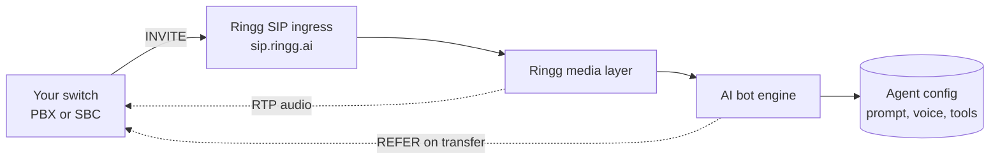
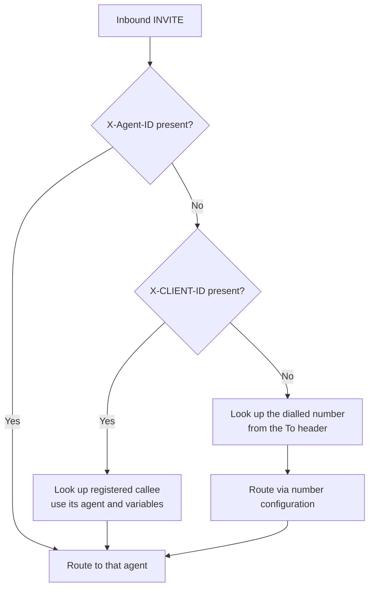
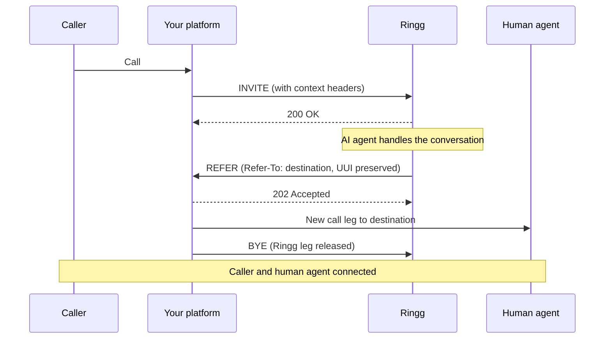
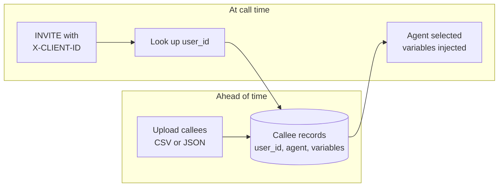

## Overview

A SIP integration connects your own voice platform to Ringg over standard SIP, with no intermediate telephony provider. You keep your carrier relationships and numbers, and Ringg supplies the AI agent that handles the conversation.

The integration works in two directions, and most customers enable both:

<CardGroup cols={2}>
  <Card title="Inbound" icon="phone-incoming">
    Your switch sends an INVITE to Ringg. Ringg answers, picks the right AI agent, and runs the conversation.
  </Card>
  <Card title="Outbound" icon="phone-outgoing">
    Ringg sends an INVITE to your trunk. Your platform routes the call out to the customer.
  </Card>
</CardGroup>

### What each side provides

| Ringg gives you | You give Ringg |
| --- | --- |
| A SIP ingress IP and ports | Your signalling IP or CIDR, so we can allowlist it |
| An RTP media range to allow through your firewall | Your trunk host and port for outbound calls |
| Agent routing by header or dialled number | Optional SIP auth credentials, if you do not use IP auth |
| Context injection through SIP headers | The transfer destination, if you use call transfer |

---

## 1. Network requirements

### SIP signalling

| Setting | Value | Media |
| --- | --- | --- |
| SIP domain (FQDN) | `sip.ringg.ai` | |
| UDP | `5060` | Plain RTP |
| TCP | `5060` | Plain RTP |
| TLS | `5061` | SRTP |

```
sip:sip.ringg.ai:5060          UDP or TCP
sips:sip.ringg.ai:5061         TLS
```

Use `sip.ringg.ai` as the destination in your trunk configuration. Ringg shares the underlying ingress and media IP addresses with you during onboarding, for your firewall and ACL rules.

<Note>
Media encryption follows the signalling transport, and is not configured separately. Connect over **TLS on 5061** and the media is negotiated as **SDES-SRTP** (`RTP/SAVP`) using the `AES_CM_128_HMAC_SHA1_80` cipher suite. Connect over UDP or TCP on 5060 and the media is plain RTP.

If you require encrypted media, use TLS. There is no option to run SRTP over a plaintext signalling transport.
</Note>

<Warning>
For TLS, always connect to `sips:sip.ringg.ai:5061` rather than to the IP address. The certificate is issued for the hostname `sip.ringg.ai`, so a client that connects by IP and validates the certificate will fail on a hostname mismatch.
</Warning>

### RTP media

Media is bridged on the same address as signalling.

| Setting | Value |
| --- | --- |
| RTP IP | Shared during onboarding |
| RTP ports | `10000` to `60000` UDP |
| Encryption | SDES-SRTP on TLS trunks, plain RTP on UDP and TCP trunks |

<Warning>
The most common cause of a connected call with no audio is a firewall that permits SIP on 5060 but blocks the RTP range. Allow UDP `10000-60000` in both directions to the Ringg media addresses before testing.
</Warning>

### Codecs

| Codec | Support |
| --- | --- |
| G.711 u-law (PCMU) | Supported |
| G.711 a-law (PCMA) | Supported |

### Session timers

Ringg supports RFC 4028 session timers with a minimum `Session-Expires` of **1800 seconds**. A shorter value is rejected with `422 Session Interval Too Small`. Either raise the value on your side or omit the header.

---

## 2. How a call flows



Ringg terminates the SIP leg, bridges the audio into the AI bot engine, and runs the conversation using the agent configuration resolved from the call. If the agent decides to hand the call to a human, Ringg sends a SIP REFER back to your platform.

---

## 3. Inbound: your platform to Ringg

### 3.1 Point your trunk at Ringg

Set the origination or termination URI on your SIP trunk to the Ringg ingress:

```
sip:sip.ringg.ai:5060
sips:sip.ringg.ai:5061
```

### 3.2 Allowlisting

Ringg authenticates inbound calls by **source IP**. Send Ringg the signalling IP or CIDR your platform originates from, and it is added to the inbound ACL.

<Note>
Ringg accepts CIDR blocks up to `/18`. Anything broader is rejected, because it would allowlist a large portion of the public internet and defeat the purpose of the ACL. If your carrier publishes a wider egress pool, send the specific ranges you actually originate from.
</Note>

### 3.3 Custom SIP headers

Ringg reads these headers from the inbound INVITE. All are optional except where your chosen routing method requires them.

| Header | Purpose | Example |
| --- | --- | --- |
| `X-Agent-ID` | Route directly to a specific AI agent | `d72859cd-e113-4aa1-87ae-2999ed788f77` |
| `X-Workspace-ID` | Identifies your Ringg workspace | `2b37ba17-7b20-4b3e-b138-1161e351d5c5` |
| `X-CLIENT-ID` | Per-user lookup against your registered callees | `+919XXXXXXXXX` |
| `X-Custom-Vars` | Key and value pairs injected into the conversation | `customer_name=Ravi Kumar&account_id=ACC-9910` |
| `X-Call-ID` | Your own call identifier, used for tracking instead of the SIP Call-ID | `enterprise-call-001` |
| `User-to-User` | RFC 7433 UUI payload, used by Genesys and similar platforms | See [section 5](#5-genesys-cloud-byoc) |

Example INVITE:

```
INVITE sip:+919XXXXXXXXX@sip.ringg.ai SIP/2.0
X-Agent-ID: d72859cd-e113-4aa1-87ae-2999ed788f77
X-Workspace-ID: 2b37ba17-7b20-4b3e-b138-1161e351d5c5
X-Custom-Vars: customer_name=Ravi Kumar&account_id=ACC-9910
X-Call-ID: enterprise-call-001
```

### 3.4 Choosing which agent answers

Ringg resolves the agent in this order:



<AccordionGroup>
  <Accordion title="Direct routing with X-Agent-ID">
    The most explicit option. Ringg routes straight to the agent you name and skips every lookup. Use this when your platform already knows which AI agent should handle the call.
  </Accordion>
  <Accordion title="Per-user routing with X-CLIENT-ID">
    Ringg looks up a registered callee record for that user and uses the agent and variables stored against it. See [section 8](#8-inbound-callees) for what a callee record is and how to create one.
  </Accordion>
  <Accordion title="Number-based routing">
    With no routing headers, Ringg uses the dialled number from the To header or Request-URI and routes according to that number's configuration in your workspace.
  </Accordion>
</AccordionGroup>

---

## 4. Passing context into the conversation

Context lets the agent open the call already knowing who it is speaking to, instead of asking.

### 4.1 X-Custom-Vars

`X-Custom-Vars` carries an `&` separated list of `key=value` pairs:

```
X-Custom-Vars: customer_name=Ravi Kumar&account_id=ACC-9910&loan_amount=50000
```

### 4.2 Using the values

Every key becomes available in the agent's system prompt and intro message as `@{{key}}`:

```
System prompt:
  You are speaking to @{{customer_name}} about account @{{account_id}}.

Intro message:
  Hello @{{customer_name}}, this is Ringg calling about your loan of @{{loan_amount}}.
```

<Note>
Keep values short and avoid characters that need escaping in a SIP header. `&` and `=` are structural separators in `X-Custom-Vars`, so a value containing either will not parse as you expect.
</Note>

---

## 5. Genesys Cloud (BYOC)

Genesys Cloud BYOC trunks do not generally send `X-Custom-Vars`. They carry call context in the standard RFC 7433 **User-to-User** header instead, and Ringg supports that natively.

### 5.1 The header

```
User-to-User: 00637573746f6d65725f6e616d653d5261...;encoding=hex;purpose=isdn-uui;content=isdn-uui
```

### 5.2 Encoding

| Property | Detail |
| --- | --- |
| Encoding | Hex, declared with `encoding=hex` |
| Leading byte | `00` protocol discriminator, stripped by Ringg |
| Payload | Once decoded, an `&` separated `key=value` string, the same shape as `X-Custom-Vars` |
| Multiple headers | Ringg reads up to 8 `User-to-User` header instances and concatenates them |

A decoded payload looks like this:

```
customer_name=Ravi Kumar&account_id=ACC-9910&ticket_id=TKT-4471&lang=en-in&priority=high
```

### 5.3 What Ringg does with it

<Steps>
  <Step title="Read">
    Ringg reads every `User-to-User` header on the inbound INVITE.
  </Step>
  <Step title="Decode">
    The hex payload is decoded and the leading `00` discriminator is removed.
  </Step>
  <Step title="Inject">
    Each decoded key becomes a conversation variable, usable as `@{{key}}` exactly like `X-Custom-Vars`.
  </Step>
  <Step title="Return on transfer">
    When the agent transfers the call, Ringg puts the UUI back on the `Refer-To` URI so your platform keeps the same context on the onward leg.
  </Step>
</Steps>

### 5.4 Keep the UUI small

<Warning>
UUI content is hex encoded, so every byte of payload becomes two characters on the wire. A 200 byte payload becomes a 400 character header.

On transfer, that header is carried inside the `Refer-To` URI of the REFER. A large UUI can push the REFER past the 1500 byte network MTU, which forces IP fragmentation. Some SBCs and firewalls silently drop IP fragments, and the transfer then fails with no useful error.

Keep the UUI payload under roughly 150 bytes. Send identifiers such as a ticket or conversation ID rather than free text, and look up the detail on your side after the transfer completes.
</Warning>

---

## 6. Outbound: Ringg to your trunk

For outbound calls, Ringg originates the INVITE toward your platform from a fixed set of source addresses. Ringg provides these during onboarding, and you allow them in your inbound firewall and SIP ACL.

### 6.1 What Ringg needs from you

| Item | Required | Notes |
| --- | --- | --- |
| Public host or IP | Required | The address Ringg sends the INVITE to |
| Port | Required | Typically `5060`, or `5061` for TLS |
| Transport | Required | `udp`, `tcp`, or `tls` |
| Auth method | Optional | IP based, digest, or register. See below |
| Username and password | Only for digest or register | Not needed for IP based auth |
| Realm | Optional | Only if your platform challenges with a realm different from its host |

### 6.2 Authentication modes

<AccordionGroup>
  <Accordion title="IP based (simplest)">
    You allowlist the Ringg source addresses on your side and no credentials are exchanged. Recommended where your platform supports it.
  </Accordion>
  <Accordion title="Digest, on 401 or 407 challenge">
    Your platform challenges the INVITE and Ringg answers using the username and password you supply. If your platform challenges with a realm that is not its hostname, you must tell Ringg the realm, otherwise authentication fails.
  </Accordion>
  <Accordion title="SIP REGISTER">
    Ringg registers to your platform on an interval using the credentials you supply, and your platform routes calls to the resulting registration. The same realm caveat applies.
  </Accordion>
</AccordionGroup>

<Note>
If you use digest or register, send the exact realm your platform challenges with. A realm mismatch causes the registration or authentication to fail silently and retry indefinitely, with no calls connecting.
</Note>

---

## 7. Call transfer with SIP REFER

When the AI agent needs to hand the call to a human or another destination, Ringg sends a **SIP REFER** on the existing dialog. Your platform performs the actual transfer.



### What your platform must support

| Requirement | Detail |
| --- | --- |
| `REFER` method | Advertise `REFER` in your `Allow` header |
| `Refer-To` | Accept the destination Ringg supplies, as a SIP or SIPS URI |
| `Referred-By` | Sent by Ringg per RFC 3892 |
| `202 Accepted` | Expected response to the REFER |

### Notes on behaviour

<AccordionGroup>
  <Accordion title="BYE immediately after 202 is normal">
    Many platforms send their own BYE to release the Ringg leg as soon as they accept the REFER. Ringg handles this and does not treat it as an error.
  </Accordion>
  <Accordion title="Context is preserved across the transfer">
    Where a UUI was received on the inbound call, Ringg re-attaches it to the `Refer-To` URI so the onward leg keeps the same context. See the size guidance in [section 5.4](#54-keep-the-uui-small).
  </Accordion>
  <Accordion title="Transport for large REFERs">
    If your transfer destinations carry large UUI payloads, prefer TCP or TLS for the trunk. UDP requests above roughly 1300 bytes are prone to fragmentation, which some networks drop.
  </Accordion>
</AccordionGroup>

---

## 8. Inbound callees

### What an inbound callee is

An **inbound callee** is a record you register with Ringg ahead of time that says: *when this specific person calls in, use this agent and start the conversation already knowing these facts about them.*

It solves a problem that headers alone cannot. If your platform cannot attach per-customer context to every INVITE, you instead upload the context once, keyed by the caller's identifier. At call time your platform only needs to send `X-CLIENT-ID`, and Ringg fills in the rest.



Each record stores:

- The `user_id` that `X-CLIENT-ID` is matched against, usually the caller's number
- The `agent_id` that should handle the call
- Any custom variables to inject into the prompt and intro message

<Note>
Records are upserted. Uploading a `user_id` that already exists overwrites its configuration rather than creating a duplicate, so you can safely re-upload the full list on a schedule.
</Note>

**API base URL:** `https://prod-api.ringg.ai/ca/api/v0`

Authenticate with your workspace API key in the `X-API-KEY` header. The key identifies the workspace, so you do not need to pass a workspace ID on these calls. You can generate a key from workspace settings in the dashboard.

<Note>
Send `X-API-KEY` on its own. Supplying both `X-API-KEY` and an `Authorization` header in the same request is rejected.
</Note>

### 8.1 Upload via CSV

```
POST /ca/api/v0/inbound-callees/upload
X-API-KEY: $RINGG_API_KEY
Content-Type: multipart/form-data
```

| Field | Type | Required | Description |
| --- | --- | --- | --- |
| `csv_file` | file | Required | CSV file containing the callee rows |
| `column_mapping` | JSON string | Required | Maps Ringg field names to your CSV column names. Must include `user_id` |
| `agent_id` | string (UUID) | Optional | Assigns one agent to every callee in the upload |
| `transliterate_callee_name` | bool | Optional | Transliterates `callee_name` into the agent's language |
| `transliterate_fields` | JSON array | Optional | Additional fields to transliterate |

<CodeGroup>
```csv callees.csv
phone,name,acc_no
+919XXXXXXXXX,Ravi Kumar,ACC-9910
+919YYYYYYYYY,Priya Sharma,ACC-1122
```

```bash Upload
curl -X POST https://prod-api.ringg.ai/ca/api/v0/inbound-callees/upload \
  -H "X-API-KEY: $RINGG_API_KEY" \
  -F "csv_file=@callees.csv" \
  -F 'column_mapping={"user_id":"phone","callee_name":"name","account_id":"acc_no"}' \
  -F "agent_id=d72859cd-e113-4aa1-87ae-2999ed788f77"
```
</CodeGroup>

### 8.2 Upload via JSON

```
POST /ca/api/v0/inbound-callees/upload-json
X-API-KEY: $RINGG_API_KEY
Content-Type: application/json
```

| Field | Type | Required | Description |
| --- | --- | --- | --- |
| `callees` | array of objects | Required | Each object needs `user_id`. Every other key becomes a custom variable |
| `agent_id` | string (UUID) | Optional | Applies to all callees. A per callee `agent_id` overrides it |
| `transliterate_callee_name` | bool | Optional | Transliterates `callee_name` |
| `transliterate_fields` | array of strings | Optional | Additional fields to transliterate |

```json
{
  "agent_id": "d72859cd-e113-4aa1-87ae-2999ed788f77",
  "callees": [
    {
      "user_id": "+919XXXXXXXXX",
      "callee_name": "Ravi Kumar",
      "account_id": "ACC-9910",
      "loan_amount": "50000"
    },
    {
      "user_id": "+919YYYYYYYYY",
      "callee_name": "Priya Sharma",
      "account_id": "ACC-1122"
    }
  ]
}
```

### 8.3 Upload response

Both endpoints return the same shape:

```json
{
  "created_count": 2,
  "failed_rows": [
    { "line_number": 4, "error": "user_id is required" }
  ]
}
```

| Field | Description |
| --- | --- |
| `created_count` | Number of records created or updated |
| `failed_rows` | Skipped rows, with a 1 based line number and the reason |

### 8.4 List callees

```
GET /ca/api/v0/inbound-callees
X-API-KEY: $RINGG_API_KEY
```

| Parameter | Type | Description |
| --- | --- | --- |
| `limit` | int, 1 to 100, default 10 | Page size |
| `offset` | int, default 0 | Page offset |
| `user_id` | string | Filter by exact user_id |
| `agent_id` | string (UUID) | Filter by agent |
| `start_date` | ISO 8601 | Created on or after |
| `end_date` | ISO 8601 | Created on or before |

---

## 9. Troubleshooting

| Symptom | Likely cause | Resolution |
| --- | --- | --- |
| `403` or call rejected at Ringg | Your signalling IP is not allowlisted | Send Ringg the exact source IP or CIDR you originate from |
| `422 Session Interval Too Small` | `Session-Expires` below 1800 s | Raise it to 1800 s or more, or omit the header |
| TLS handshake fails or certificate is rejected | Connecting to the IP instead of the hostname | Use `sips:sip.ringg.ai:5061`. The certificate is issued for `sip.ringg.ai`, not for the IP |
| Call connects but there is no audio | RTP range blocked | Allow UDP `10000-60000` to and from the Ringg media addresses |
| No audio on a TLS trunk specifically | SRTP not offered, or an unsupported cipher suite | Ringg negotiates SDES-SRTP with `AES_CM_128_HMAC_SHA1_80`. Confirm your SBC offers `RTP/SAVP` with that suite, and that DTLS is not being forced |
| Agent does not answer as expected | `X-Agent-ID` missing or invalid | Confirm the UUID is correct and the agent is published |
| Context variables are empty | `X-Custom-Vars` malformed, or UUI not hex encoded | Check the `&` and `=` separators, and that `encoding=hex` is present |
| Callee lookup fails | `X-CLIENT-ID` does not match any `user_id` | Confirm the number format matches exactly what was uploaded |
| Transfer never completes | REFER not supported, or REFER too large and fragmented | Advertise `REFER` in `Allow`, shrink the UUI, and prefer TCP or TLS |
| Outbound calls never connect | Realm mismatch on digest or register auth | Send Ringg the exact realm your platform challenges with |

---

## 10. Onboarding checklist

<Steps>
  <Step title="Contact Ringg to start the integration">
    Email [admin@ringg.ai](mailto:admin@ringg.ai) requesting a SIP integration, and include the details below so the trunk can be provisioned in one pass:

    - Company name and your Ringg workspace
    - Direction needed: inbound, outbound, or both
    - Your SIP signalling IP or CIDR, for the inbound allowlist
    - For outbound, your trunk host, port, and transport (`udp`, `tcp`, or `tls`)
    - Preferred authentication: IP based, digest, or register. For digest or register, include the username, password, and the exact realm your platform challenges with
    - Whether the agent needs to transfer calls, and the destination to transfer to
    - How you will pass context: `X-Custom-Vars`, or the `User-to-User` header if you are on Genesys Cloud

    Ringg confirms the allowlist entry and returns your trunk configuration, including the SIP ingress and RTP media IP addresses to allow in your firewall.
  </Step>
  <Step title="Apply your firewall rules">
    Point your trunk at `sip.ringg.ai`, and allow the addresses Ringg provided on 5060 UDP and TCP, 5061 TLS, plus UDP `10000-60000` for RTP, in both directions.
  </Step>
  <Step title="Decide how agents are selected">
    Direct with `X-Agent-ID`, per user with `X-CLIENT-ID` and registered callees, or by dialled number.
  </Step>
  <Step title="Decide how context is passed">
    `X-Custom-Vars` for standard trunks, or the `User-to-User` header for Genesys Cloud.
  </Step>
  <Step title="Confirm transfer requirements">
    If the agent will hand off to a human, confirm your platform accepts REFER and agree the destination.
  </Step>
  <Step title="Run a test call">
    Place a call in each enabled direction and verify two way audio, correct agent selection, injected variables, and transfer.
  </Step>
</Steps>
