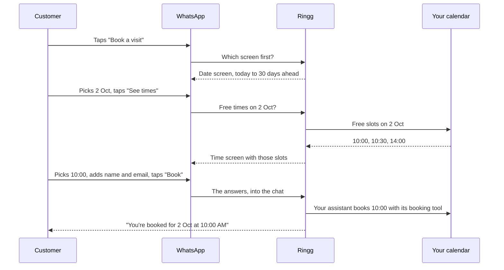

A static Flow only shows what you typed in WhatsApp Manager. A **dynamic Flow** asks for fresh information while the customer is inside it. The dashboard calls this **Live data**. For example, the customer picks a date and the next screen lists the times still free in your calendar that day.

Ringg does the technical part for you. It hosts the connection WhatsApp needs (the *endpoint*), handles WhatsApp's encryption, and fetches the data. You choose where the data comes from:

| Source | Use it for | Who sets it up |
|---|---|---|
| **A calendar** | Showing free appointment slots from Calendly, Google Calendar or Cal.com | Anyone, by following this page. No code needed. |
| **Your server** | Anything from your own systems: branches near a pincode, stock, prices, order status | A developer on your team. See [Live data from your server](/whatsapp/flows-your-server). |

<Note>
Read [WhatsApp Flows](/whatsapp/flows) first. Adding a Flow to an assistant, the prompt, and where answers show up all work the same way with live data.
</Note>

## How a booking Flow works



The Flow itself doesn't book anything. It shows the free times and sends the customer's choice back to the chat. Your assistant then books the slot with the calendar's booking tool and confirms, just as it would on a call.

## Set up appointment booking

This walkthrough builds a working booking Flow from a ready-made design. Plan about 15 minutes.

### Before you start

- A WhatsApp assistant with a **Ready** WhatsApp number attached. See [Create a WhatsApp agent](/whatsapp/create-agent).
- Calendly, Google Calendar or Cal.com connected under **Integrations** in Ringg.
- Access to the same WhatsApp Business account in Meta's [WhatsApp Manager](https://business.facebook.com/wa/manage/home/).

<Steps>
  <Step title="Create the Flow in WhatsApp Manager">
    In WhatsApp Manager, open **Account tools → Flows** and select **Create Flow**. Name it, for example *Book a visit*, choose the category **Appointment booking**, and start from a blank Flow.
  </Step>
  <Step title="Paste the ready-made design">
    The builder shows the Flow's code on the left and a preview on the right. Select everything in the code editor, delete it, and paste the design below. The preview should show a **Pick a date** screen.

    <Accordion title="Booking Flow design: copy all of it">
      ```json
      {
        "version": "6.3",
        "data_api_version": "3.0",
        "routing_model": { "PICK_DATE": ["PICK_SLOT"], "PICK_SLOT": [] },
        "screens": [
          {
            "id": "PICK_DATE",
            "title": "Pick a date",
            "data": {
              "min_date": { "type": "string", "__example__": "2026-10-01" },
              "max_date": { "type": "string", "__example__": "2026-10-31" }
            },
            "layout": {
              "type": "SingleColumnLayout",
              "children": [
                {
                  "type": "DatePicker",
                  "name": "date",
                  "label": "Date",
                  "required": true,
                  "min-date": "${data.min_date}",
                  "max-date": "${data.max_date}"
                },
                {
                  "type": "Footer",
                  "label": "See times",
                  "on-click-action": { "name": "data_exchange", "payload": { "date": "${form.date}" } }
                }
              ]
            }
          },
          {
            "id": "PICK_SLOT",
            "title": "Pick a time",
            "terminal": true,
            "data": {
              "date": { "type": "string", "__example__": "2026-10-02" },
              "slots": {
                "type": "array",
                "items": {
                  "type": "object",
                  "properties": { "id": { "type": "string" }, "title": { "type": "string" } }
                },
                "__example__": [{ "id": "2026-10-02T10:00:00+05:30", "title": "10:00 AM" }]
              }
            },
            "layout": {
              "type": "SingleColumnLayout",
              "children": [
                {
                  "type": "RadioButtonsGroup",
                  "name": "slot",
                  "label": "Available times",
                  "data-source": "${data.slots}",
                  "required": true
                },
                { "type": "TextInput", "name": "name", "label": "Your name", "required": true },
                { "type": "TextInput", "name": "email", "label": "Email", "input-type": "email", "required": true },
                {
                  "type": "Footer",
                  "label": "Book",
                  "on-click-action": {
                    "name": "complete",
                    "payload": {
                      "date": "${data.date}",
                      "slot": "${form.slot}",
                      "name": "${form.name}",
                      "email": "${form.email}"
                    }
                  }
                }
              ]
            }
          }
        ]
      }
      ```
    </Accordion>

    Select **Save**. Don't publish yet: the Flow needs its live data connected first.
  </Step>
  <Step title="Open the Flow in Ringg">
    In Ringg, go to **Integrations → WhatsApp Business**, open your account and select the **Flows** tab. It syncs as it opens. Select **Book a visit**. It shows as **Draft**, which is expected.
  </Step>
  <Step title="Connect your calendar">
    In the Flow's details, under **Live data**, select **Set up live data**, then choose **A calendar** and fill in:

    | Setting | What to enter |
    |---|---|
    | **Calendar** | The calendar to read free times from. |
    | **Event type link** (Calendly) or **Event type ID** (Cal.com) | The meeting type to offer, for example your *30 minute site visit*. Leave it empty to use the account's first one. In Cal.com, the ID is the number at the end of the address when you edit the event type. For Calendly, it is the event type's API link, which starts with `https://api.calendly.com/event_types/`. |
    | **Calendar ID** and **Slot length** (Google Calendar) | Leave the calendar ID empty to use the main calendar. Slot length is how long each appointment is, in minutes. |
    | **Date screen** | **Pick a date** |
    | **Slots screen** | **Pick a time** |
    | **Date field** | `date`. Leave it as it is. |
    | **Timezone** | Where your appointments happen, such as `Asia/Kolkata` or `Asia/Dubai`. |
    | **Days ahead** | How far ahead customers can book. 30 by default. |
    | **Most slots shown** | The most times listed for one day. 20 by default. |

    Select **Save**.
  </Step>
  <Step title="Check the result">
    After saving, Ringg tells you where things stand:

    - ***WhatsApp calls Ringg for this Flow's data.*** Everything is connected. Go to the next step.
    - ***Meta kept this Flow's own endpoint*** with a URL beneath it. This happens when the Flow was already published. Copy the URL with the copy icon. In WhatsApp Manager, open the Flow, paste the URL as its **endpoint**, and publish it again.
  </Step>
  <Step title="Finish in WhatsApp Manager">
    Back in the Flow in WhatsApp Manager:

    1. Open the Flow's endpoint settings. The endpoint URL should end in `/exchange`.
    2. **Connect your Meta app**: choose the app you connected when you set up WhatsApp Business on Ringg.
    3. Run the **health check**. It should pass.
    4. Open the **Preview**, pick a date and check that times appear.
    5. **Publish** the Flow.
  </Step>
  <Step title="Sync in Ringg">
    In the **Flows** tab, select the refresh icon. **Book a visit** now shows as **Published**, with **Calendar, via Ringg** under **Live data**.
  </Step>
</Steps>

{/* RECORDING meta-06-flow-builder: WhatsApp Manager → Account tools → Flows → Create Flow → paste the booking design → Save; later the endpoint settings: connect the Meta app, health check passing, preview with a date, Publish. Mask business details.
<Frame caption="In WhatsApp Manager: pasting the booking design, then connecting the app, running the health check and publishing.">
  <video autoPlay muted loop playsInline preload="metadata" poster="https://storage.googleapis.com/ringg-cdn/images/ringg-docs/whatsapp/meta-06-flow-builder.png" className="w-full rounded-lg">
    <source src="https://storage.googleapis.com/ringg-cdn/videos/ringg-docs/whatsapp/meta-06-flow-builder.mp4" type="video/mp4" />
  </video>
</Frame>
*/}

<Frame caption="Connecting a calendar to a Flow under Live data.">
  <video autoPlay muted loop playsInline preload="metadata" poster="https://storage.googleapis.com/ringg-cdn/images/ringg-docs/whatsapp/19-live-data-calendar.png" className="w-full rounded-lg">
    <source src="https://storage.googleapis.com/ringg-cdn/videos/ringg-docs/whatsapp/19-live-data-calendar.mp4" type="video/mp4" />
  </video>
</Frame>

## Let your assistant send it and book

<Steps>
  <Step title="Add the Flow to the assistant">
    In the agent editor, expand **WhatsApp Flows**, open **Add a Flow** and pick **Book a visit**. Write the **Message** and **Button label**, for example *Tap below to pick a time for your visit.* and *Book a visit*.

    Set **Opens on** to **Loaded by the Flow's endpoint**, so every customer starts on today's dates. Select **Save**.
  </Step>
  <Step title="Add the calendar's booking tool">
    Select **Tools** in the left menu, then **On-call → Integration**, pick your calendar and add its booking tool:

    | Calendar | Booking tool |
    |---|---|
    | Calendly | **Schedule Event** |
    | Google Calendar | **Create Booking** |
    | Cal.com | **Create Booking** |

    Set the start time, name and email to **Dynamic**, so the assistant fills them in from the Flow's answers. Give fixed settings, such as the event type and timezone, a **Static** value.
  </Step>
  <Step title="Tell the assistant what to do">
    Tag both tools in the prompt with `@`:

    ```text
    When the customer wants to book a visit, send @||send_book_a_visit||.
    When they submit it, book the time they picked with the calendar booking tool,
    using "Available times" as the start time and their name and email.
    Then confirm the date and time in plain words, like "2 Oct at 10:00 AM".
    If the time is no longer free, say so and send @||send_book_a_visit|| again.
    ```
  </Step>
  <Step title="Test it">
    Open **Test assistant**, scan the QR code and ask to book a visit. Pick a date, check that the times match your calendar, choose one, submit, and look for the booking in your calendar.
  </Step>
</Steps>

The answers reach the assistant like this. The time the customer picked arrives in full, with its date and timezone, which is the format booking tools expect:

```text
User submitted the WhatsApp Flow "Book a visit" (sent with send_book_a_visit):
date=2026-10-02, Available times=2026-10-02T10:00:00+05:30, Your name=Priya Sharma, Email=priya@example.com
```

## Change the design safely

You can change the words the customer sees without breaking anything:

- Screen titles, such as `"title": "Pick a date"`.
- Field and button labels, such as `"label": "See times"`.
- Extra questions on the **Pick a time** screen, such as a phone number or notes. Add each one to the `payload` of the **Book** button as well, or its answer won't come back.

Leave these exactly as they are, because Ringg relies on them:

| Keep | Why |
|---|---|
| `"data_api_version": "3.0"` and the `routing_model` | They tell WhatsApp this Flow loads live data. |
| The screen IDs `PICK_DATE` and `PICK_SLOT` | Ringg sends each answer to these screens. If you rename them, pick the new names under **Live data** again. |
| `"name": "date"` on the date picker, and `"date"` in the **See times** payload | That is the **Date field** Ringg reads. |
| `${data.min_date}`, `${data.max_date}`, `${data.slots}`, `${data.date}` and the `data` blocks | These are where Ringg's dates and free times appear. |

After changing a published Flow, clone it, publish the copy, and set up live data on the copy.

## Troubleshooting

| You see | Where | What to do |
|---|---|---|
| *Connect Calendly, Google Calendar or Cal.com in Integrations first.* | Live data setup | Connect a calendar under **Integrations**, then come back. |
| *Meta kept this Flow's own endpoint* | Live data, after saving | Paste the URL shown as the Flow's endpoint in WhatsApp Manager, publish, then sync. |
| Health check fails with *Unknown Flow* | WhatsApp Manager | Live data isn't saved on this Flow in Ringg yet. Save it, then run the check again. |
| Health check fails with a signature error (432) | WhatsApp Manager | The wrong Meta app is connected to the Flow. Connect the app you use with Ringg. |
| The Flow says it can't open, or the health check reports a key problem (421) | Phone or WhatsApp Manager | The number's encryption key isn't Ringg's. Open **Live data** in Ringg and save again. This puts Ringg's key back on every number of the account. |
| *No free slots on 2 Oct. Pick another date.* | The customer's phone | The calendar has no free times that day. Check the event type and the calendar's working hours. |
| *Couldn't load free slots. Please try again.* | The customer's phone | Ringg couldn't read the calendar. Reconnect it under **Integrations** and check the event type. |
| *Booking isn't available right now.* | The customer's phone | The calendar was disconnected. Reconnect it, then pick it again under **Live data**. |
| Times are an hour or more off | The customer's phone | Set the right **Timezone** under **Live data**. |

## Good to know

<AccordionGroup>
  <Accordion title="Ringg sets an encryption key on your WhatsApp numbers">
    WhatsApp encrypts everything a Flow sends, using a key set on each phone number. When you save live data, Ringg puts its key on every number of the WhatsApp Business account, reusing the key it already has. If a developer connected the same numbers to their own Flow server with a different key, that setup stops working. Talk to them first, or have them use [Your server](/whatsapp/flows-your-server) instead.
  </Accordion>
  <Accordion title="Published Flows">
    Changing a published Flow's endpoint moves it back to Draft in WhatsApp Manager, so Ringg never changes it for you. If a published Flow isn't already using Ringg's endpoint, saving live data shows the URL to paste in WhatsApp Manager, and you publish the Flow again there. Setting up live data before you publish avoids this.
  </Accordion>
  <Accordion title="A slot can be taken in the meantime">
    Free times are read when the customer picks a date. If someone else books the same time before they submit, the booking tool returns an error and the assistant can offer another time, as the prompt above tells it to.
  </Accordion>
  <Accordion title="Remove live data">
    Open the Flow in the **Flows** tab and select **Remove** under **Live data**. The Flow then has nowhere to load its data from, so stop sending it or remove it from your assistants first.
  </Accordion>
</AccordionGroup>
