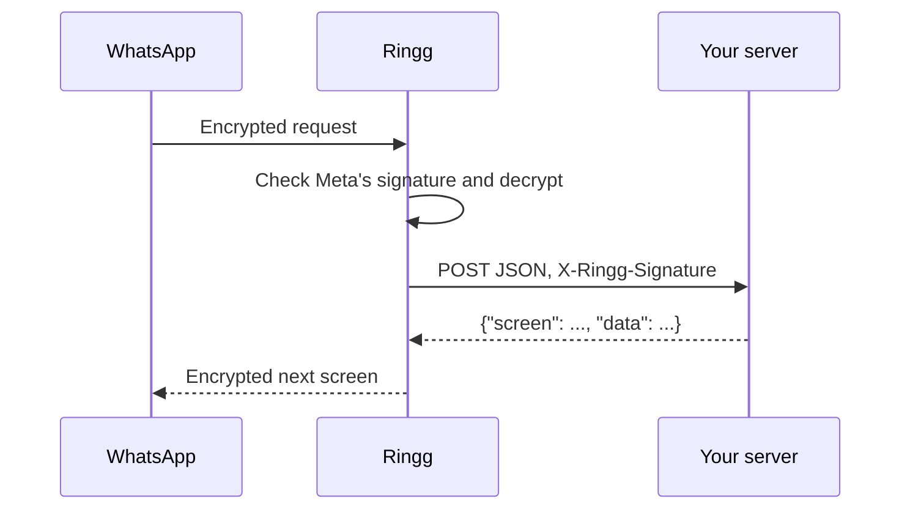

Choose **Your server** under a Flow's **Live data** when its screens need data from your own systems, such as branches near a pincode, stock, prices, order status or availability from a system Ringg doesn't connect to.

WhatsApp normally requires every Flow endpoint to handle its RSA and AES encryption, key management and health checks. With this option, Ringg does all of that. Your server gets one plain JSON `POST` per screen change, signed so you can trust it, and returns the next screen as JSON.



<Note>
This page is for developers. For the dashboard steps and how answers reach your assistant, see [WhatsApp Flows](/whatsapp/flows) and [Flows with live data](/whatsapp/flows-live-data).
</Note>

## What you need to build

1. **A Flow** in WhatsApp Manager whose screens read data from the endpoint.
2. **One HTTPS endpoint** on your server that:
   - accepts `POST` requests with a JSON body;
   - checks the `X-Ringg-Signature` header against the raw body;
   - answers within **7 seconds** with HTTP `200` and the next screen as JSON.

That is all. You don't handle WhatsApp's encryption keys, the health check (`ping`) or WhatsApp's error notifications. Ringg answers those itself.

## Example: find a showroom by pincode

The customer enters a pincode, your server looks up nearby showrooms, and the customer picks one. The same pattern works for any lookup.

### 1. The Flow

Create a Flow in WhatsApp Manager (**Account tools → Flows → Create Flow**), paste this into the code editor and **Save**. Don't publish it yet.

```json
{
  "version": "6.3",
  "data_api_version": "3.0",
  "routing_model": { "PINCODE": ["PICK_SHOWROOM"], "PICK_SHOWROOM": [] },
  "screens": [
    {
      "id": "PINCODE",
      "title": "Find a showroom",
      "layout": {
        "type": "SingleColumnLayout",
        "children": [
          { "type": "TextInput", "name": "pincode", "label": "Your pincode", "input-type": "number", "required": true },
          {
            "type": "Footer",
            "label": "Find showrooms",
            "on-click-action": { "name": "data_exchange", "payload": { "pincode": "${form.pincode}" } }
          }
        ]
      }
    },
    {
      "id": "PICK_SHOWROOM",
      "title": "Pick a showroom",
      "terminal": true,
      "data": {
        "pincode": { "type": "string", "__example__": "560001" },
        "showrooms": {
          "type": "array",
          "items": {
            "type": "object",
            "properties": {
              "id": { "type": "string" },
              "title": { "type": "string" },
              "description": { "type": "string" }
            }
          },
          "__example__": [{ "id": "blr-mg-road", "title": "MG Road", "description": "2.1 km away" }]
        }
      },
      "layout": {
        "type": "SingleColumnLayout",
        "children": [
          {
            "type": "RadioButtonsGroup",
            "name": "showroom",
            "label": "Showrooms near you",
            "data-source": "${data.showrooms}",
            "required": true
          },
          {
            "type": "Footer",
            "label": "Confirm",
            "on-click-action": {
              "name": "complete",
              "payload": { "pincode": "${data.pincode}", "showroom": "${form.showroom}" }
            }
          }
        ]
      }
    }
  ]
}
```

What makes it a live-data Flow:

- `"data_api_version": "3.0"` and a `routing_model` listing which screen can lead to which.
- A `data_exchange` action. Its `payload` is exactly what your server receives as `data`.
- A `data` block on each screen that shows your server's values, with an `__example__` for Meta's preview. Your response must match these types.

### 2. The endpoint

<CodeGroup>
```python Python (FastAPI)
import hashlib
import hmac
import json
import os

from fastapi import FastAPI, HTTPException, Request

app = FastAPI()
SIGNING_SECRET = os.environ["RINGG_FLOW_SIGNING_SECRET"]

SHOWROOMS = {
    "560001": [{"id": "blr-mg-road", "title": "MG Road", "description": "2.1 km away"}],
}


@app.post("/whatsapp-flow")
async def whatsapp_flow(request: Request):
    raw_body = await request.body()
    expected = "sha256=" + hmac.new(SIGNING_SECRET.encode(), raw_body, hashlib.sha256).hexdigest()
    if not hmac.compare_digest(expected, request.headers.get("X-Ringg-Signature", "")):
        raise HTTPException(status_code=401)

    body = json.loads(raw_body)
    data = body.get("data") or {}

    if body["action"] == "data_exchange" and body.get("screen") == "PINCODE":
        pincode = str(data.get("pincode", "")).strip()
        showrooms = SHOWROOMS.get(pincode)
        if not showrooms:
            # Keeps the customer on this screen and shows the message.
            return {"screen": "PINCODE", "data": {"error_message": f"No showroom near {pincode} yet."}}
        return {"screen": "PICK_SHOWROOM", "data": {"pincode": pincode, "showrooms": showrooms}}

    # INIT (the Flow opened) and BACK: start on the first screen.
    return {"screen": "PINCODE", "data": {}}
```

```javascript Node.js (Express)
const crypto = require("crypto");
const express = require("express");

const app = express();
const SIGNING_SECRET = process.env.RINGG_FLOW_SIGNING_SECRET;

const SHOWROOMS = {
  "560001": [{ id: "blr-mg-road", title: "MG Road", description: "2.1 km away" }],
};

// express.raw keeps the exact bytes Ringg signed.
app.post("/whatsapp-flow", express.raw({ type: "application/json" }), (req, res) => {
  const expected = "sha256=" + crypto.createHmac("sha256", SIGNING_SECRET).update(req.body).digest("hex");
  const received = req.get("X-Ringg-Signature") || "";
  if (received.length !== expected.length || !crypto.timingSafeEqual(Buffer.from(received), Buffer.from(expected))) {
    return res.sendStatus(401);
  }

  const { action, screen, data = {} } = JSON.parse(req.body);

  if (action === "data_exchange" && screen === "PINCODE") {
    const pincode = String(data.pincode || "").trim();
    const showrooms = SHOWROOMS[pincode];
    if (!showrooms) {
      return res.json({ screen: "PINCODE", data: { error_message: `No showroom near ${pincode} yet.` } });
    }
    return res.json({ screen: "PICK_SHOWROOM", data: { pincode, showrooms } });
  }

  // INIT (the Flow opened) and BACK: start on the first screen.
  res.json({ screen: "PINCODE", data: {} });
});

app.listen(3000);
```
</CodeGroup>

### 3. Connect it in Ringg

<Steps>
  <Step title="Open the Flow">
    Go to **Integrations → WhatsApp Business**, open your account, select the **Flows** tab and open the Flow.
  </Step>
  <Step title="Enter your server's URL">
    Under **Live data**, select **Set up live data**, choose **Your server** and enter your endpoint's URL, for example `https://api.example.com/whatsapp-flow`. Select **Save**.
  </Step>
  <Step title="Copy the signing secret">
    Ringg shows a **signing secret** once. Copy it and store it on your server, for example as `RINGG_FLOW_SIGNING_SECRET`. It can't be shown again. If it is lost, edit the live data, tick **Issue a new signing secret** and save.
  </Step>
  <Step title="Check the endpoint">
    If Ringg says ***Meta kept this Flow's own endpoint***, copy the URL shown and paste it as the Flow's endpoint in WhatsApp Manager. That URL is Ringg's, not your server's: WhatsApp calls Ringg, and Ringg calls you.
  </Step>
  <Step title="Finish in WhatsApp Manager">
    Open the Flow's endpoint settings, connect the Meta app you use with Ringg, and run the **health check**. Ringg answers it, so it passes even before your server is live. Then **Preview** the Flow, which calls your server for real, and **Publish** it.
  </Step>
  <Step title="Add it to an assistant">
    Sync the **Flows** tab, then add the Flow to a WhatsApp assistant as described in [WhatsApp Flows](/whatsapp/flows#let-your-assistant-send-it). Set **Opens on** to **Loaded by the Flow's endpoint**, so your server is asked for the first screen.
  </Step>
</Steps>

<Frame caption="Choosing Your server under Live data and entering its URL. After saving, Ringg shows the signing secret once.">
  <video autoPlay muted loop playsInline preload="metadata" poster="https://storage.googleapis.com/ringg-cdn/images/ringg-docs/whatsapp/20-live-data-your-server.png" className="w-full rounded-lg">
    <source src="https://storage.googleapis.com/ringg-cdn/videos/ringg-docs/whatsapp/20-live-data-your-server.mp4" type="video/mp4" />
  </video>
</Frame>

## Request reference

Ringg sends one `POST` for every step that needs your server.

| `action` | When | `screen` | `data` |
|---|---|---|---|
| `INIT` | The customer opened a Flow sent with **Opens on: Loaded by the Flow's endpoint** | `null` | `{}` |
| `data_exchange` | The customer pressed a button whose action is `data_exchange` | The screen they were on | That action's `payload` |
| `BACK` | The customer went back to a screen that has `"refresh_on_back": true` | The screen they went back to | `{}` |

```json
{
  "action": "data_exchange",
  "screen": "PINCODE",
  "data": { "pincode": "560001" },
  "flow_token": "rf2.3c6e2a1d-5b7f-4e8a-9c21-0f4d7b8e6a53.b7e4c2a0-1d3f-4e5a-8b9c-0d1e2f3a4b5c.9f2c41ab",
  "flow": {
    "id": "8d1f3a6e-2b4c-4d5e-9f60-7a8b9c0d1e2f",
    "meta_flow_id": "1234567890123456",
    "name": "Find a showroom"
  },
  "context": {
    "chat_id": "3c6e2a1d-5b7f-4e8a-9c21-0f4d7b8e6a53",
    "tool_id": "b7e4c2a0-1d3f-4e5a-8b9c-0d1e2f3a4b5c"
  }
}
```

| Field | Description |
|---|---|
| `action` | `INIT`, `data_exchange` or `BACK`, as above. |
| `screen` | The screen ID the request comes from. `null` for `INIT`. |
| `data` | What the Flow sent. For `data_exchange`, the action's `payload` with the customer's input filled in. |
| `flow_token` | WhatsApp's token for this Flow session. Pass it back if you [finish the Flow yourself](#finish-the-flow-from-your-server). Treat it as opaque. |
| `flow.id` | Ringg's ID for the Flow. |
| `flow.meta_flow_id` | Meta's ID for the Flow, as shown in WhatsApp Manager. |
| `flow.name` | The Flow's name. |
| `context.chat_id` | The Ringg chat the Flow was sent in. It is the same `chat_id` as in [chat events](/whatsapp/events) and **Logs → WhatsApp**, so you can tie a Flow session to a conversation. |
| `context.tool_id` | The ID of the assistant's Flow tool that sent it, which stays the same while the Flow is on the assistant. `template` when the customer opened it from a template's Flow button. |

`context` is `{}` when the Flow wasn't sent by Ringg, for example in WhatsApp Manager's preview. Don't require it.

**Headers**

| Header | Value |
|---|---|
| `Content-Type` | `application/json` |
| `X-Ringg-Signature` | `sha256=` followed by the hex HMAC-SHA256 of the **raw request body**, keyed with your signing secret |

<Warning>
Verify the signature against the exact bytes you received, before parsing them. Parsing the JSON and serialising it again changes the spacing, so the signature won't match.
</Warning>

## Response reference

Return HTTP `200` with a JSON body naming the next screen and the data it reads:

```json
{ "screen": "PICK_SHOWROOM", "data": { "pincode": "560001", "showrooms": [{ "id": "blr-mg-road", "title": "MG Road" }] } }
```

- `screen` must be a screen of the Flow that the current screen can lead to in `routing_model`, or the current screen itself.
- `data` must match the types in that screen's `data` block.

Ringg passes your response to WhatsApp unchanged, so a response that breaks these rules shows the customer WhatsApp's generic error.

### Keep the customer on the screen with a message

Return the screen the request came from, with `error_message` in `data`. WhatsApp shows the message at the bottom of the screen and keeps what the customer entered.

```json
{ "screen": "PINCODE", "data": { "error_message": "No showroom near 560999 yet." } }
```

### Finish the Flow from your server

To close the Flow yourself, for example after you created an order, return WhatsApp's `SUCCESS` screen with the request's `flow_token` and anything you want to send back. You don't need a `SUCCESS` screen in the Flow JSON.

```json
{
  "screen": "SUCCESS",
  "data": {
    "extension_message_response": {
      "params": { "flow_token": "<the flow_token from the request>", "order_id": "A-1042", "showroom": "MG Road" }
    }
  }
}
```

The `params` reach the assistant as the customer's submission, just like a Flow finished with a `complete` action: *order_id=A-1042, showroom=MG Road*. Use readable keys, since they are the labels the assistant sees.

## Rules and limits

| Rule | Detail |
|---|---|
| **HTTPS only** | The URL must start with `https://`. |
| **Public address** | Addresses on private or internal networks are refused, both when you save and before every request. |
| **7 seconds** | WhatsApp gives Ringg 10 seconds, so your server gets 7. There is one attempt and no retry. |
| **No redirects** | Answer at the URL you saved. Redirects aren't followed. |
| **HTTP 200** | Any other status, a timeout, or a body without `screen` or `data` keeps the customer on the screen with *This form can't load right now. Please try again shortly.* |
| **One secret per Flow** | Each Flow with live data has its own signing secret. |
| **New secret takes effect at once** | After **Issue a new signing secret**, requests are signed with the new secret straight away. Accept both secrets on your server while you switch. |

## Test your endpoint

Send your server a signed request from a terminal before connecting it in Ringg:

```bash
SECRET="your signing secret"
BODY='{"action": "data_exchange", "screen": "PINCODE", "data": {"pincode": "560001"}, "flow_token": "test", "flow": {"id": "test", "meta_flow_id": "1", "name": "Find a showroom"}, "context": {}}'
SIGNATURE=$(printf '%s' "$BODY" | openssl dgst -sha256 -hmac "$SECRET" | sed 's/^.* //')

curl -s https://api.example.com/whatsapp-flow \
  -H "Content-Type: application/json" \
  -H "X-Ringg-Signature: sha256=$SIGNATURE" \
  -d "$BODY"
```

You should get the `PICK_SHOWROOM` screen back. Then use **Preview** in WhatsApp Manager to run the Flow end to end.

## Troubleshooting

| Symptom | Cause |
|---|---|
| *Your server's URL* is marked invalid, or saving fails | The URL isn't `https://`, or it points to a private or internal address. |
| Every request fails your signature check | You're hashing re-serialised JSON instead of the raw body, or using an old secret. |
| *This form can't load right now* on the phone | Your server took longer than 7 seconds, returned a status other than `200`, redirected, or returned a body without `screen` or `data`. |
| WhatsApp's generic error on the phone | Your response names a screen the current one can't lead to, or its `data` doesn't match the screen's `data` block. |
| Your server gets no `INIT` | The Flow was sent with **Opens on** set to a screen, so it opens without asking you. Set it to **Loaded by the Flow's endpoint**. |
| The health check fails | Ringg answers the health check itself, so the problem is on the Meta side. See [troubleshooting for live data](/whatsapp/flows-live-data#troubleshooting). |

<Warning>
Ringg sets its own encryption key on every number of the WhatsApp Business account when you save live data. If you also run a WhatsApp Flow endpoint of your own on those numbers with a different key, it stops working. Move those Flows to **Your server** so Ringg handles the encryption for all of them.
</Warning>
