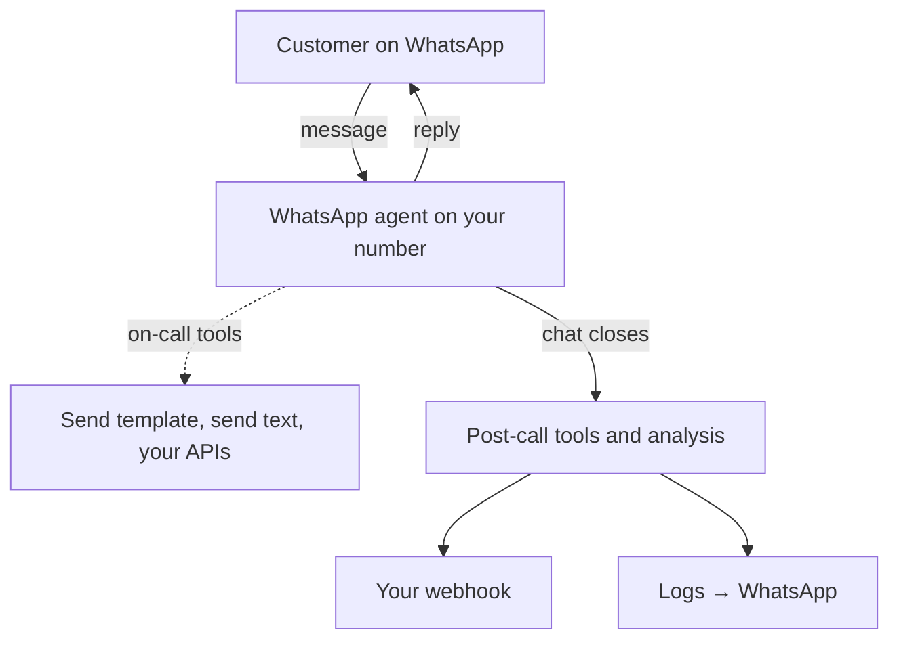

A WhatsApp agent is a Ringg AI assistant that answers your customers on a WhatsApp Business number you own. It uses the same prompt, knowledge base, custom variables and tools as a voice assistant, but it replies in text messages instead of speech. Every conversation lands in **Logs** with its full transcript.

Setup is done entirely from the dashboard. You connect your WhatsApp Business account with Meta's own sign-in, add your numbers and message templates, create an assistant of type **WhatsApp**, and attach a number to it.

<Frame caption="Integrations → WhatsApp Business opens the connected account, with its numbers and message templates.">
  <video autoPlay muted loop playsInline preload="metadata" poster="https://storage.googleapis.com/ringg-cdn/images/ringg-docs/whatsapp/01-open-whatsapp-integration.png" className="w-full rounded-lg">
    <source src="https://storage.googleapis.com/ringg-cdn/videos/ringg-docs/whatsapp/01-open-whatsapp-integration.mp4" type="video/mp4" />
  </video>
</Frame>

## What you can build

<CardGroup cols={2}>
  <Card title="Connect WhatsApp Business" icon="plug" href="/whatsapp/onboarding">
    Link your WhatsApp Business account through Meta. Then add and verify numbers, write message templates, and add WhatsApp send tools to any assistant.
  </Card>
  <Card title="Create a WhatsApp agent" icon="bot" href="/whatsapp/create-agent">
    Start from the WhatsApp template, attach a WhatsApp number, write a chat-first prompt, and test it by scanning a QR code with your phone.
  </Card>
  <Card title="Events and webhooks" icon="webhook" href="/whatsapp/events">
    Get notified when a chat closes and when its analysis is ready, with the transcript in the payload.
  </Card>
  <Card title="Chat history" icon="history" href="/whatsapp/chat-history">
    Filter WhatsApp conversations, read transcripts as chat bubbles, and export a CSV by email.
  </Card>
</CardGroup>

## How it fits together

1. A customer messages your WhatsApp Business number.
2. The agent attached to that number opens a chat session. It runs any pre-call tools, then replies using its prompt, knowledge base and on-call tools.
3. When the chat closes, post-call tools run. Platform and advanced analysis follow, and each step can notify your webhook.
4. The conversation, its analysis and every tool call appear under **Logs → WhatsApp**.

## Setup checklist

<Steps>
  <Step title="Connect your WhatsApp Business account">
    **Integrations → WhatsApp Business → Setup WhatsApp Business Account**. In Meta's window, pick the phone number, business portfolio and WhatsApp Business account to share, then confirm. See [Connect WhatsApp Business](/whatsapp/onboarding#connect-your-whatsapp-business-account).
  </Step>
  <Step title="Register the number">
    The number you pick in Meta's window shows up on the account page as **Pending**. Select **Register** so it can send and receive messages. You can add more numbers later with **Add number**. See [Add more numbers](/whatsapp/onboarding#add-more-numbers).
  </Step>
  <Step title="Create message templates (optional)">
    Templates are needed for any message sent outside the 24-hour customer service window. Meta reviews them before use. See [Message templates](/whatsapp/onboarding#message-templates).
  </Step>
  <Step title="Create a WhatsApp agent and attach the number">
    **Assistants → Create agent → WhatsApp → Single Prompt**. Pick the number on the second step. See [Create a WhatsApp agent](/whatsapp/create-agent).
  </Step>
  <Step title="Add tools and webhooks">
    Add **Send WhatsApp Template** or **Send WhatsApp Text** as [on-call](/whatsapp/on-call-tools) or [post-call](/whatsapp/post-call-tools) tools, and subscribe your endpoint to [chat events](/whatsapp/events).
  </Step>
  <Step title="Test it">
    Open **Test assistant** in the agent editor and scan the QR code with your phone to start a real chat.
  </Step>
</Steps>

## WhatsApp compared with voice

| | Voice assistant | WhatsApp assistant |
|---|---|---|
| Channel | Phone call or web call | WhatsApp text messages |
| Number | Telephony number | Registered WhatsApp Business number |
| Pre-call, on-call and post-call tools | Yes | Yes, plus WhatsApp send tools |
| Webhook events | `call_*`, `recording_completed` and the analysis events | `chat_completed` and the analysis events |
| Where conversations appear | **Logs → Phone** | **Logs → WhatsApp** |
| Analytics dashboard | Yes | Not yet, since analytics are call-only |

## Good to know

<AccordionGroup>
  <Accordion title="One WhatsApp Business account per workspace">
    The dashboard manages one connected WhatsApp Business account (WABA) per workspace. A WABA can only be connected to one workspace at a time. Connecting it in a second workspace fails until you disconnect it from the first.
  </Accordion>
  <Accordion title="The 24-hour customer service window">
    WhatsApp only delivers free-form text within 24 hours of the customer's last message. Outside that window you must send an approved template. This is why **Send WhatsApp Text** is offered as an on-call tool only, while **Send WhatsApp Template** works both on-call and post-call.
  </Accordion>
  <Accordion title="Templates are reviewed by Meta">
    A new or edited template shows **In review** until Meta approves it, which can take up to a day. Only templates with status **Ready** can be sent or picked in a tool.
  </Accordion>
  <Accordion title="Formatting in replies">
    WhatsApp uses its own markup: `*bold*`, `_italic_`, `~strikethrough~`, and lists that start with `- `. It has no headings, tables or Markdown links. The WhatsApp agent template already tells the model this. Keep those rules if you rewrite the prompt.
  </Accordion>
</AccordionGroup>
