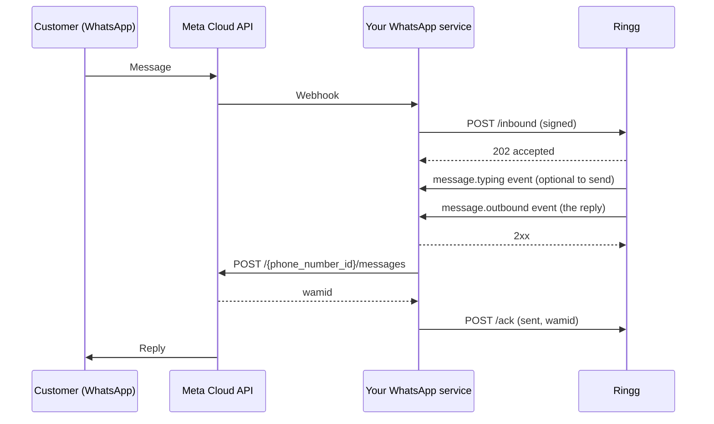

WhatsApp Relay lets a Ringg AI agent answer customers on a WhatsApp Business number that **stays in your own Meta account**. Ringg never holds your WhatsApp access token and never calls Meta for you.

Instead, your WhatsApp service sits in the middle:

- **Customer messages:** you forward each one to Ringg.
- **Replies:** Ringg answers with a ready-to-send WhatsApp message on your webhook.
- **Sending:** your service posts that reply to Meta, then tells Ringg whether it went out.

Your human agents can work the same chats. When one of them steps away, you hand the conversation to the AI agent with the history so far, and it carries on from there.

<Note>
If Ringg can hold your WhatsApp Business account instead, the [standard WhatsApp setup](/whatsapp/overview) is simpler: connect the account in the dashboard and Ringg talks to Meta directly. Relay is for businesses that need the account, the token and the Meta traffic to stay with them.
</Note>

## How it works

1. **Forward:** a customer messages your number. Meta notifies your service, and your service forwards the message to Ringg's `/inbound` endpoint, signed with your keys.
2. **Reply:** Ringg's agent reads the whole conversation and writes a reply. Ringg posts it to your webhook as a `message.outbound` event, in a format you can send to Meta unchanged.
3. **Send and acknowledge:** your service sends the reply to Meta, then reports the result to Ringg's `/ack` endpoint. Ringg uses this to keep its record of the conversation true to what the customer actually saw.

Ringg can also open a conversation with an approved template, and close one with a final message. See [Integration guide](/whatsapp/relay/integration-guide).

## In this section

<CardGroup cols={2}>
  <Card title="What's supported" icon="list-checks" href="/whatsapp/relay/supported">
    Message types, conversation features and limits, and what is not supported yet.
  </Card>
  <Card title="What we need from you" icon="clipboard-list" href="/whatsapp/relay/client-requirements">
    The details to share for setup, and what your WhatsApp service has to do.
  </Card>
  <Card title="What Ringg provides" icon="package" href="/whatsapp/relay/ringg-provides">
    Credentials, the AI agent, delivery guarantees, and dashboard visibility.
  </Card>
  <Card title="Integration guide" icon="code" href="/whatsapp/relay/integration-guide">
    Authentication, every endpoint, the events Ringg sends you, and error codes.
  </Card>
  <Card title="Hand over from a human agent" icon="users" href="/whatsapp/relay/handover">
    Pass a conversation from your agent to the AI agent, and take it back.
  </Card>
  <Card title="Troubleshooting" icon="wrench" href="/whatsapp/relay/troubleshooting">
    Symptoms, causes and fixes, and what to send us when you need help.
  </Card>
  <Card title="FAQ" icon="circle-help" href="/whatsapp/relay/faq">
    Short answers to the questions integrators ask most.
  </Card>
</CardGroup>

## Key terms

| Term | Meaning |
|---|---|
| `phone_number_id` | Meta's id for your WhatsApp number. Every relay request carries it, and it is how Ringg finds the agent attached to the number. |
| Chat | One conversation between a customer and your number, identified by `chat_id`. A new chat starts when the previous one has closed. |
| Event | A message from Ringg to your webhook: `message.outbound`, `message.typing` or `conversation.closed`. |
| Ack | Your report of what happened when you sent a `message.outbound` event to Meta: `sent`, `failed` or `skipped`. |
| Handover | Forwarding a message together with the conversation your human agent had so far, so the AI agent continues it. |
